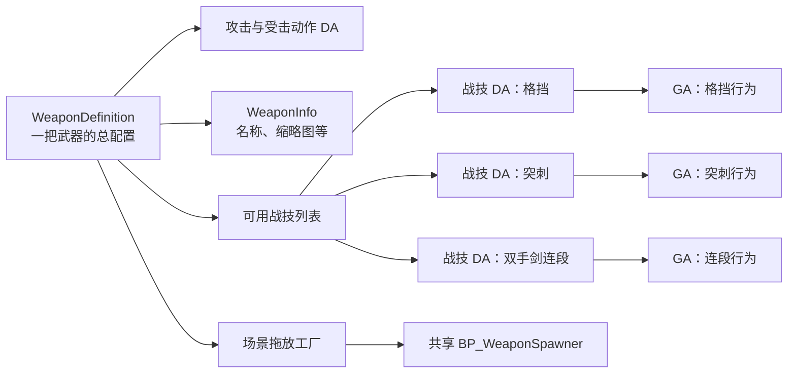

# Weapon Manager 使用指南

> 面向对象：武器美术、动画、特效、战斗策划、关卡与测试人员  
> 工具入口：`YogTool → Balance Editors → 武器管理器`  
> 正式资产根目录：`/Game/Code/Weapon`  
> 交互演示：[打开 Weapon Manager 交互式使用指南](WeaponManager交互式使用指南.html)  
> 程序说明：[查看 Weapon Manager 设计与维护文档](WeaponManager设计与维护文档.md)

## 1. 一句话理解这套方案

一把武器由一个 `WeaponDefinition` 数据资产统一配置；每种战技由一个独立的 C++ `GA` 负责行为，再由一个对应的战技 `DA` 保存蒙太奇、图标和说明。武器可以拥有多种候选战技，但进入战斗时只装配其中一种。



## 2. 先认识三个名词

| 名词 | 在本方案中的作用 | 谁负责修改 | 是否直接拖入场景 |
|---|---|---|---|
| `DA`（Data Asset） | 保存配置，例如武器、战技、蒙太奇、图标和文字 | 美术、动画、策划 | DA 本身不是 Actor；从 Weapon Manager 拖拽时会自动创建预览 Actor |
| `GA`（Gameplay Ability） | 执行战技逻辑，例如格挡持续、突刺结算、连段推进 | 程序 | 否 |
| `BP`（Blueprint Actor） | 作为场景里的武器预览载体 | 程序维护共享模板；使用人员无需为每把武器复制 | 是，由拖拽自动生成 |

场景中看到的是共享的 `/Game/Code/Weapon/BP_WeaponSpawner`，它读取所拖武器的 `WeaponDefinition` 后显示对应模型。不要为每把武器复制一个新的 Spawner BP。

## 3. 正式资产与测试资产

只有位于以下根目录的武器定义会被认定为“正式”：

```text
/Game/Code/Weapon
```

推荐每把武器使用独立文件夹：

```text
/Game/Code/Weapon/<WeaponName>/
├─ DA_WPN_<WeaponName>           武器总配置
├─ DA_Attack_<WeaponName>        主动攻击动作
├─ DA_Passive_<WeaponName>       被动反应动作
├─ DA_WPN_Info_<WeaponName>      名称、缩略图等展示信息
└─ WeaponSkills/
   ├─ DA_WS_<WeaponName>_<Skill>   战技定义
   └─ DA_WSA_<WeaponName>_<Skill>  战技蒙太奇数据
```

- “正式”筛选：只显示 `/Game/Code/Weapon` 内的武器。
- “测试”筛选：显示根目录以外的武器，便于实验但不会混入正式列表。
- 搜索框：支持按资产名、对象路径和武器类型搜索。
- 正式发布前必须把武器迁移到正式目录，并修复所有重定向引用。

## 4. 界面分区

### 4.1 顶部工具栏

| 按钮 | 作用 |
|---|---|
| 新建武器 | 创建武器定义以及基础攻击、被动反应、武器信息 DA |
| 刷新 | 重新扫描武器资产、战技类型和验证状态 |
| 签出 / 保存 | 签出并保存当前武器及它直接管理的 DA |

“签出 / 保存”会处理：

- 当前 `WeaponDefinition`
- `AttackAbilityData`
- `PassiveAbilityData`
- `WeaponInfo`
- `AvailableWeaponSkills` 中的所有战技 DA
- 每个战技引用的蒙太奇数据 DA

它不会保存关卡、角色材质、渲染资源或其他无关资产。

### 4.2 左侧：武器库

每张武器卡片会显示：

- `WeaponInfo.Thumbnail` 缩略图
- `WeaponInfo.WeaponName` 展示名
- 正式/测试分类
- 当前验证警告数量

交互方式：

- 单击：选择武器。
- `Ctrl+B`：在内容浏览器中定位当前武器的 `WeaponDefinition`。
- 从卡片拖到关卡：创建一个共享 `BP_WeaponSpawner` 实例，并自动绑定当前武器。
- 切换“正式 / 测试”：按资产路径筛选。

### 4.3 中间：配置区域

| 页签 | 用途 |
|---|---|
| 动作配置 | 配置普通攻击、冲刺攻击、换弹、切换武器和被动反应 |
| 武器战技 | 创建、移除、设为默认并编辑当前战技 |
| 武器详情 | 编辑模型、偏移、武器类型、投射物、展示信息等总配置 |

### 4.4 右侧：数据检查器

右侧会随当前操作显示对应 DA：

- 选择主动动作时：显示 `AttackAbilityData`
- 选择被动反应时：显示 `PassiveAbilityData`
- 选择战技时：显示该战技 DA
- 打开武器详情时：显示 `WeaponDefinition`

这样可以在一个窗口内完成常用配置，无需反复打开多个资产编辑器。

### 4.5 底部状态栏

显示当前武器、警告数量和操作反馈。保存或创建资产后要确认这里没有失败提示。

## 5. 新建一把武器

### 5.1 准备

1. 确认当前工作区已同步到正确 P4 主线。
2. 在 P4 中检查自己当前的 `opened` 和 pending CL，避免把无关资产混入武器任务。
3. 打开 Weapon Manager，保持“正式”筛选。
4. 点击“新建武器”。

### 5.2 填写创建对话框

建议使用不带空格的英文短名，例如：

```text
THSword
Spear
Pistol
```

创建位置使用：

```text
/Game/Code/Weapon/<WeaponName>
```

工具会创建：

```text
DA_WPN_<WeaponName>
DA_Attack_<WeaponName>
DA_Passive_<WeaponName>
DA_WPN_Info_<WeaponName>
```

### 5.3 必填基础配置

在“武器详情”中至少完成：

| 字段 | 必填 | 作用 |
|---|---:|---|
| `Display Mesh` | 是 | 场景预览与拖放显示使用的武器模型 |
| `Weapon Type` | 是 | 武器类别与运行时行为分类 |
| `Weapon Info` | 是 | 武器名、图标、缩略图等展示信息 |
| `Actors To Spawn` | 按项目规则 | 装备到角色时实际生成的武器 Actor；它与场景预览 BP 不是一回事 |
| `Projectile Definition` | 远程武器必填 | 远程投射物配置 |

建议同时检查：

- `Weapon Mesh Offset`
- `Weapon Rotation`
- `Weapon Mesh Scale`
- `Weapon Layer`
- `Heat Overlay Material`
- `Initial Combat Deck`
- `Just Combo Effect`

### 5.4 配置动作

“动作配置”中可配置以下主动动作：

| 分组 | 动作槽 |
|---|---|
| 普通攻击 | 攻击连段 1–4 |
| 冲刺 | 冲刺 |
| 冲刺后续 | 冲刺连段 1–4 |
| 其他 | 换弹、切换武器 |

当前正式可运行的被动反应：

- 正面受击
- 背面受击
- 被格挡
- 被招架
- 死亡

以下被动反应目前只保留标签和配置入口，尚未接入正式运行时逻辑：

- 左侧受击、右侧受击、重击
- 硬直、破防、击倒、起身、击飞
- 重落地、处决受害、背刺受害

缺少蒙太奇的动作在运行时会被判定为不可用；工具不会静默播放错误的备用动作。

## 6. 配置武器战技

### 6.1 规则

- 一个不同的战技类型对应一个独立 C++ `GA`。
- 一个不同的战技类型对应一个独立 C++ 战技 DA 类型。
- 每把武器可以配置多个候选战技。
- 同一时刻只装配一个战技。
- `Default Weapon Skill` 决定进入战斗时默认装配的战技。

### 6.2 为武器添加已有战技类型

1. 选择目标武器。
2. 切换到“武器战技”。
3. 点击“添加战技”。
4. 从程序已经注册的战技类型中选择，例如：
   - 双手剑连段
   - 格挡
   - 突刺
5. 工具会在 `<WeaponFolder>/WeaponSkills` 中创建战技 DA 和蒙太奇数据 DA。
6. 在右侧配置该战技需要的蒙太奇槽。
7. 点击“设为默认”决定该武器首次装备的战技。
8. 点击“签出 / 保存”。

工具只显示该 GA 声明的蒙太奇槽：

| 战技 | 显示槽位 | 行为 |
|---|---:|---|
| 双手剑连段 | 连段动作 1–4 | 在连段窗口内按顺序推进 |
| 格挡 | 格挡动作 | 按住持续，松开结束 |
| 突刺 | 突刺动作 | 单次释放 |

### 6.3 “移除战技”的真实含义

“移除战技”只会从当前武器的候选列表中删除引用，不会删除硬盘上的 DA 文件。

这是故意的安全设计：

- 避免误删仍被其他武器引用的资产。
- 便于在 P4 中审查资产去留。
- 如果需要永久删除，必须先用引用查看器确认没有使用者，再单独处理。

如果被移除的是默认战技，工具会从剩余完整战技中选择新的默认项；如果没有完整项，则默认战技为空并产生警告。

### 6.4 新增一种从未存在过的战技

这不是纯美术配置工作，需要程序参与：

1. 程序注册新的 `Weapon.Skill.*` Gameplay Tag。
2. 新建专用的 `UGA_WeaponSkill` C++ 子类并实现行为。
3. 新建专用的 `UWeaponSkillDataAsset` C++ 子类，声明独有参数。
4. 在 GA 默认对象中填写中文显示名、中文简介、数据类型和蒙太奇槽数量。
5. 编译 `DevKit` 与 `DevKitEditor`。
6. 刷新 Weapon Manager，新类型会自动出现在“添加战技”列表。
7. 美术/动画再创建该武器的战技 DA，配置蒙太奇和表现资源。

不建议把所有战技参数继续堆进一个通用 DA，也不建议只复制蓝图 GA 来绕过 C++ 类型约束。

## 7. 拖入场景预览

### 7.1 正确操作

1. 确认武器已配置 `Display Mesh`。
2. 在左侧武器库按住武器卡片。
3. 拖到关卡视口。
4. 释放后会创建 `BP_WeaponSpawner`。
5. 工厂将当前 `WeaponDefinition` 写入 Spawner 并重新执行构造脚本。
6. Spawner 根据模型、偏移、旋转和缩放显示武器。

### 7.2 常见误解

- **不是**把 DA 变成了 Actor。
- **不是**每把武器都需要一个专用 BP。
- `Display Mesh` 是场景预览模型。
- `Actors To Spawn` 是角色真正装备武器时生成的 Actor 列表。
- 修改预览 BP 的通用逻辑会影响所有武器；只调整某把武器时应改它的 DA。

## 8. 保存、P4 与交付

### 8.1 日常保存顺序

1. 在 Weapon Manager 点击“签出 / 保存”。
2. 确认状态栏没有保存失败。
3. 在 P4 中检查 `p4 opened`，确认只包含本任务资产。
4. 运行或请求武器配置自动化测试。
5. 由任务负责人将相关文件放入一个编号 CL。
6. 提交前检查 resolve、依赖资产和警告。

### 8.2 不要做的事情

- 不要在未检查 `p4 opened` 前创建或提交 CL。
- 不要把角色材质、描边、关卡或渲染改动混进武器配置 CL。
- 不要在 `/Game/Code/Weapon` 以外创建正式武器。
- 不要为每把武器复制 `BP_WeaponSpawner`。
- 不要因为“移除战技”后文件还在就直接批量删除 DA。
- UGS 工作区遇到 Missing Modules 时不要点击“是”自行编译；应报告 PCB/BuildId 问题。

### 8.3 哪些修改需要新 PCB

| 修改类型 | 是否需要编译 | 是否需要发布 PCB |
|---|---:|---:|
| 只改现有 DA 中的模型、蒙太奇、文字、偏移 | 否 | 通常否 |
| 修改项目 C++、新增 GA、修改 Weapon Manager | 是 | 是 |
| 修改引擎源码或引擎 Shader | 需要完整引擎流程 | 需要先发布新的 source-free Installed Build，再重新构建项目 PCB |

项目 GitHub 只维护项目代码；不要上传完整引擎源码、项目内容资产、PCB 和生成目录。

## 9. 提交前验收清单

### 9.1 新武器

- [ ] 资产位于 `/Game/Code/Weapon/<WeaponName>`
- [ ] 名称符合 `DA_WPN_`、`DA_Attack_`、`DA_Passive_`、`DA_WPN_Info_` 规范
- [ ] `WeaponInfo` 有正确中文名和缩略图
- [ ] `DisplayMesh` 有效
- [ ] 武器类型正确
- [ ] 模型偏移、旋转、缩放正确
- [ ] 必要攻击蒙太奇完整
- [ ] 至少一个完整战技，或明确允许没有战技
- [ ] `DefaultWeaponSkill` 属于候选列表且数据完整
- [ ] 能从武器库拖入场景
- [ ] `Ctrl+B` 能定位到武器 DA
- [ ] 状态栏与验证没有未解释警告
- [ ] P4 opened 中没有无关资产

### 9.2 新战技

- [ ] 使用独立 GA C++ 类
- [ ] 使用独立战技 DA C++ 类
- [ ] Gameplay Tag 位于 `Weapon.Skill.*`
- [ ] 有中文显示名和中文简介
- [ ] GA 声明的蒙太奇槽与运行逻辑一致
- [ ] 战技 DA 同时引用 `AbilityClass` 和 `AbilityData`
- [ ] 已加入武器候选列表
- [ ] 默认战技明确
- [ ] 缺少蒙太奇时会安全拒绝，不扣除错误的冷却/消耗
- [ ] 编辑器与运行时自动化测试通过

## 10. 故障排查

| 现象 | 优先检查 | 处理 |
|---|---|---|
| 武器不在正式列表 | 资产路径 | 移到 `/Game/Code/Weapon` 并修复引用 |
| 列表没有武器 | 筛选、搜索、Asset Registry | 清空搜索，切换测试筛选，点击刷新 |
| 拖入场景失败 | `DisplayMesh`、Spawner BP | 补齐模型；确认共享 BP 未丢失 |
| 场景模型位置错误 | Offset/Rotation/Scale | 在武器 DA 中调整，不复制 BP |
| 战技不能设为默认 | 是否在候选列表、AbilityClass、AbilityData | 补齐两个引用并重新选择 |
| 战技没有出现 | GA 是否为原生、具体、非弃用类；Tag 是否有效 | 编译项目模块并刷新 |
| 只显示很少的蒙太奇槽 | GA 的 `RequiredMontageSlots` | 这是类型约束；需要程序确认，不要在 DA 中强塞额外槽 |
| 移除战技后 DA 仍在 | 安全策略 | 正常现象；确认无引用后再单独删除 |
| 中文名仍显示旧英文 | 资产已序列化旧值 | 手动更新该 DA，或由程序执行迁移工具 |
| 保存失败 | P4 签出、只读属性、路径权限 | 检查文件是否签出以及当前 P4 用户/工作区 |
| UGS 打开报 Missing Modules | PCB 与 Engine BuildId | 不要本地重编 UGS 引擎；交给构建维护人员检查 |

## 11. 职责建议

| 角色 | 主要负责 |
|---|---|
| 武器美术 | 模型、材质引用、缩略图、预览偏移与缩放 |
| 动画 | 攻击、受击、格挡、突刺、连段蒙太奇 |
| 特效 | 战技与动作使用的表现资产；不修改通用角色渲染功能 |
| 战斗策划 | 武器类型、候选战技、默认战技、动作数据与体验验收 |
| 程序 | 新 GA/DA 类型、运行逻辑、标签、验证、测试和迁移 |
| 构建维护 | 项目编译、UGS PCB、BuildId 一致性和同事端开箱验证 |

## 12. 相关文件

- 交互演示：`Docs/03_策划配置与制作手册/编辑器/数据编辑器/WeaponManager交互式使用指南.html`
- 程序设计与维护：`Docs/03_策划配置与制作手册/编辑器/数据编辑器/WeaponManager设计与维护文档.md`
- 武器定义：`Source/DevKit/Public/Item/Weapon/WeaponDefinition.h`
- 战技 DA：`Source/DevKit/Public/Data/WeaponSkillDataAsset.h`
- 战技基类：`Source/DevKit/Public/AbilitySystem/Abilities/GA_WeaponSkill.h`
- 初始战技类型：`Source/DevKit/Public/AbilitySystem/Abilities/GA_WeaponSkillTypes.h`
- 编辑器工具：`Source/DevKitEditor/Private/Tools/WeaponManager/SWeaponManagerWidget.cpp`
- 场景拖放工厂：`Source/DevKitEditor/Private/Tools/WeaponManager/WeaponDefinitionActorFactory.cpp`
- 武器预览 Actor：`Source/DevKit/Private/Item/Weapon/WeaponSpawner.cpp`
