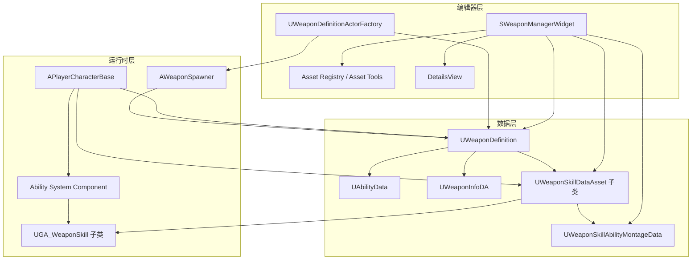
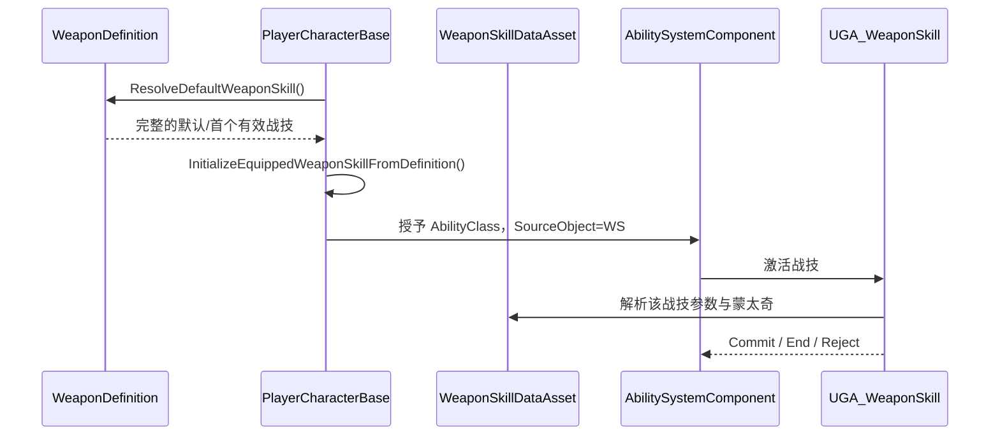

# Weapon Manager 设计与维护文档

> 面向对象：战斗程序、编辑器工具程序、技术策划、技术美术、构建维护人员  
> 使用人员手册：[Weapon Manager 使用指南](WeaponManager使用说明.md)  
> 可交互演示：[Weapon Manager 交互式使用指南](WeaponManager交互式使用指南.html)

## 1. 文档目的

本文描述 Dev01 武器配置方案的设计目标、数据契约、编辑器实现、运行时链路、场景拖放、测试、迁移、P4/UGS 发布边界和后续维护要求。

它解决的核心问题是：

1. 每一种战技都有自己的 C++ GA，行为互不混杂。
2. 每一种战技都有自己的 C++ DA 类型，可以持有独有参数。
3. 一把武器可以声明多个候选战技，但运行时一次只装配一个。
4. 美术和策划能在一个编辑器工具中创建、配置、验证和保存武器。
5. 武器 DA 可以从工具拖到关卡，通过共享 BP 进行可视化预览。
6. 正式与测试资产通过路径进行可审计分类。

## 2. 设计目标与非目标

### 2.1 设计目标

- `UWeaponDefinition` 是单把武器的唯一配置入口。
- 战技类型由 C++ 类决定，不用自由拼装的通用数据模拟完全不同的行为。
- 编辑器只能展示某 GA 明确声明的蒙太奇槽，避免“数据可填但运行时不读”。
- 运行时对候选列表、默认项和完整性执行同一套约束。
- 资产创建、移除和保存是保守的：不隐式删除、不跨范围保存。
- 场景预览与角色装备使用不同概念，避免把展示 BP 当成战斗 Actor。
- 用户可见名称与说明使用中文，并保留 Unreal 本地化能力。

### 2.2 非目标

- Weapon Manager 不负责修改角色渲染、材质管线、描边或场景效果。
- 它不替代 Gameplay Ability System。
- 它不把 DA 变成 Actor，也不为每把武器生成一个专用 Spawner BP。
- 它不负责完整引擎源码编译或 UGS 引擎分发。
- 它不自动永久删除失去引用的战技资产。
- 当前版本不提供战斗中切换战技的最终玩家 UI，只提供运行时装配接口和默认选择。

## 3. 总体架构



## 4. 数据模型

### 4.1 `UWeaponDefinition`

位置：

- `Source/DevKit/Public/Item/Weapon/WeaponDefinition.h`
- `Source/DevKit/Private/Item/Weapon/WeaponDefinition.cpp`

它是武器配置的单一事实来源，主要字段分为以下几组。

#### 动作与战技

| 字段 | 契约 |
|---|---|
| `AttackAbilityData` | 普通攻击、冲刺、换弹和切换武器等主动动作 |
| `PassiveAbilityData` | 受击、被格挡、死亡等被动反应 |
| `AvailableWeaponSkills` | 该武器允许装配的战技集合 |
| `DefaultWeaponSkill` | 首次初始化时优先装配的战技 |
| `JustComboEffect` | Just Combo 相关效果 |

#### 装备与表现

| 字段 | 契约 |
|---|---|
| `WeaponType` | 武器分类 |
| `ProjectileDefinition` | 远程武器投射物 |
| `ActorsToSpawn` | 角色装备时生成的实际 Actor 类 |
| `DisplayMesh` | 编辑器场景预览模型 |
| `WeaponMeshOffset` | 预览和挂接偏移 |
| `WeaponRotation` | 预览和挂接旋转 |
| `WeaponMeshScale` | 预览和挂接缩放 |
| `WeaponLayer` | 武器层级/分类数据 |
| `HeatOverlayMaterial` | 受热等覆盖材质 |
| `WeaponInfo` | 展示名、缩略图等 UI 信息 |
| `InitialCombatDeck` | 初始战斗牌组 |

#### 不变量

```text
DefaultWeaponSkill == null
或
DefaultWeaponSkill ∈ AvailableWeaponSkills
且 AbilityClass != null
且 AbilityData != null
```

`ResolveDefaultWeaponSkill()` 的回退顺序：

1. 返回候选列表中完整的 `DefaultWeaponSkill`。
2. 否则返回第一个完整的候选战技。
3. 没有完整项时返回 `nullptr`。

`CanEquipWeaponSkill()` 使用相同约束，避免编辑器和运行时对“有效战技”定义不一致。

### 4.2 `UWeaponSkillDataAsset`

位置：

- `Source/DevKit/Public/Data/WeaponSkillDataAsset.h`
- `Source/DevKit/Private/Data/WeaponSkillDataAsset.cpp`

基础数据：

| 字段 | 用途 |
|---|---|
| `SkillTag` | 稳定身份，例如 `Weapon.Skill.Block` |
| `DisplayName` | 用户可见中文名称 |
| `Description` | 用户可见中文简介 |
| `Icon` | UI 图标 |
| `AbilityClass` | 具体 `UGA_WeaponSkill` C++ 类型 |
| `AbilityData` | 该技能的蒙太奇数据 |

每个行为不同的战技应新增专用 DA 子类。专用参数放在子类中，例如格挡可以增加耐力消耗、完美格挡窗口；突刺可以增加突进距离、命中段数。不要向基础类持续追加只对一个技能有效的字段。

### 4.3 `UWeaponSkillAbilityMontageData`

该类保存战技蒙太奇映射。Weapon Manager 不展示任意数量的自由槽，而是读取 GA 默认对象的 `RequiredMontageSlots`，只显示该技能正式声明的槽位。

这样可以保证：

- 数据编辑器与运行逻辑使用同一份槽位契约。
- 格挡不会错误显示四个连段槽。
- 连段缺少中间动作时能明确验证。
- 新技能可以声明自己的最小数据面。

### 4.4 弃用字段

旧版 `WeaponSkillAbilityData`、`SpecialAbilityData` 等字段只用于兼容旧资产序列化，不应继续成为新方案的运行时入口。

迁移原则：

1. 旧资产读取保持兼容。
2. 新编辑器只写新字段。
3. 迁移完成前不要直接删除 UPROPERTY，避免资产加载丢数据。
4. 通过审计工具确认没有旧引用后，再安排版本化清理。

## 5. 战技 C++ 架构

### 5.1 基类 `UGA_WeaponSkill`

位置：

- `Source/DevKit/Public/AbilitySystem/Abilities/GA_WeaponSkill.h`
- `Source/DevKit/Private/AbilitySystem/Abilities/GA_WeaponSkill.cpp`

基础职责：

- 统一战技 Gameplay Tag 与技能槽位。
- 从 Ability Source Object 解析当前装备的 `UWeaponSkillDataAsset`。
- 提供共享冷却兜底，当前默认 3 秒。
- 使用 OnCommit 时机提交消耗。
- 接入 Combat Deck 的 Weapon Skill 槽和 Finisher 角色。
- 管理连段阶段标签。

连段标签处理必须维持以下不变量：

```text
先移除 Combo1、Combo2、Combo3、Combo4
再只添加当前阶段的一个标签
```

只有 Combo1 开始广义技能标签与共享冷却；后续连段阶段不应重复启动共享冷却。

### 5.2 初始战技类型

位置：

- `Source/DevKit/Public/AbilitySystem/Abilities/GA_WeaponSkillTypes.h`
- `Source/DevKit/Private/AbilitySystem/Abilities/GA_WeaponSkillTypes.cpp`

| Tag | 中文名 | DA 类型 | 槽数 | 行为 |
|---|---|---|---:|---|
| `Weapon.Skill.THSwordCombo` | 双手剑连段 | 专用连段 DA | 4 | 在 `CanCombo` 或 `JustCombo` 窗口推进 Combo1–4 |
| `Weapon.Skill.Block` | 格挡 | 专用格挡 DA | 1 | 按住持续，松开结束 |
| `Weapon.Skill.Thrust` | 突刺 | 专用突刺 DA | 1 | 单次突刺释放 |

连段的下一段蒙太奇缺失时必须拒绝推进，且不能错误消耗冷却或成本。

### 5.3 新增一种战技的程序步骤

1. 在 `Config/Tags/WeaponSkillTag.ini` 注册 `Weapon.Skill.<Name>`。
2. 创建 `UWeaponSkillDataAsset` 子类，添加专用参数。
3. 创建 `UGA_WeaponSkill` 子类，实现激活、输入、结束和失败路径。
4. 在 GA 构造函数或 CDO 中设置：
   - `SkillTag`
   - `SkillDisplayName`
   - `SkillDescription`
   - `SkillDataAssetClass`
   - `RequiredMontageSlots`
5. 补齐自动化测试。
6. 编译 `DevKit` 和 `DevKitEditor`。
7. 打开工具并刷新，确认新类型被自动发现。
8. 用真实武器 DA 创建实例并进行 PIE/战斗验收。

代表性结构：

```cpp
UCLASS()
class DEVKIT_API UMyWeaponSkillDataAsset : public UWeaponSkillDataAsset
{
    GENERATED_BODY()

public:
    UPROPERTY(EditAnywhere, Category="技能参数", meta=(DisplayName="专用数值"))
    float SkillSpecificValue = 0.0f;
};

UCLASS()
class DEVKIT_API UGA_MyWeaponSkill : public UGA_WeaponSkill
{
    GENERATED_BODY()

public:
    UGA_MyWeaponSkill();
    virtual void ActivateAbility(/* ... */) override;
};
```

## 6. Weapon Manager 编辑器实现

位置：

- `Source/DevKitEditor/Private/Tools/WeaponManager/SWeaponManagerWidget.h`
- `Source/DevKitEditor/Private/Tools/WeaponManager/SWeaponManagerWidget.cpp`

### 6.1 资产发现

武器列表通过 Asset Registry 扫描 `UWeaponDefinition`，再按路径分类：

```text
正式：PackagePath 以 /Game/Code/Weapon 开头
测试：其他路径
```

搜索索引包括：

- 资产名
- 对象路径
- 武器类型
- WeaponInfo 展示名

正式/测试是路径契约，不依赖容易被漏填的布尔值。

### 6.2 战技类型发现

`RefreshSkillTypes()` 执行以下流程：

1. 使用 `GetDerivedClasses(UGA_WeaponSkill)` 发现派生类。
2. 同时遍历 `TObjectIterator<UClass>`，覆盖热重载后 DerivedClass 缓存尚未刷新的情况。
3. 过滤非原生、抽象、弃用和待销毁类。
4. 检查有效 `Weapon.Skill.*` Tag。
5. 从 CDO 读取显示名、简介、DA 类型和蒙太奇槽数。
6. 按 SkillTag 去重，忽略被热重载替代的旧类。

该机制使新增 C++ 战技无需在 Widget 中增加硬编码菜单项。

### 6.3 新建武器

工具在用户指定文件夹内创建：

```text
DA_WPN_<Name>
DA_Attack_<Name>
DA_Passive_<Name>
DA_WPN_Info_<Name>
```

创建流程依赖 Asset Tools 与 Asset Registry。失败路径必须：

- 在状态栏显示明确错误。
- 不覆盖已存在资产。
- 不隐式保存无关包。
- 尽量保持已创建资产可被用户识别和清理。

后续可改进为事务式创建：任何一步失败时提示已成功创建的资产清单，并提供安全回滚。

### 6.4 新建战技资产

目标目录：

```text
<WeaponFolder>/WeaponSkills
```

命名：

```text
DA_WS_<WeaponStem>_<SkillLeaf>
DA_WSA_<WeaponStem>_<SkillLeaf>
```

流程：

1. 创建 GA 指定的专用战技 DA 类型。
2. 创建 `UWeaponSkillAbilityMontageData`。
3. 写入 Tag、中文名、简介、AbilityClass、AbilityData。
4. 加入 `AvailableWeaponSkills`。
5. 如果是第一项，则设置为默认。
6. 刷新详情面板与验证状态。

### 6.5 移除战技

只删除 `AvailableWeaponSkills` 中的引用，不删除资产文件。

原因：

- Unreal 资产可能被其他武器、测试图或外部软引用使用。
- 编辑器工具无法在不扩大权限范围的前提下确定永久删除安全。
- P4 删除应由可审查的独立变更完成。

可在后续增加“孤立战技审计”，但不应把审计结果自动等同于删除授权。

### 6.6 签出与保存

保存范围是当前武器的直接依赖闭包：

```text
WeaponDefinition
├─ AttackAbilityData
├─ PassiveAbilityData
├─ WeaponInfo
└─ AvailableWeaponSkills[*]
   └─ AbilityData
```

禁止扩展到：

- 当前关卡
- 角色材质
- 渲染资产
- 不相关 WeaponDefinition
- Engine 目录

### 6.7 中文与本地化

- Slate 固定文本使用 `LOCTEXT`。
- UPROPERTY 用 `DisplayName`、`ToolTip`、`Category` 提供中文字段说明。
- 战技类型名称与简介来自 GA CDO，使创建出的 DA 与程序契约一致。
- 已经序列化过英文 `DisplayName`/`Description` 的旧 DA 不一定自动采用新的 CDO 默认值，需要资产迁移或人工更新。
- 正式多语言发布时应接入 GatherText 流程，而不是在运行时字符串拼接中维护翻译。

## 7. 运行时装配流程

主要位置：

- `Source/DevKit/Private/Character/PlayerCharacterBase.cpp`



运行时接口语义：

- `GetAvailableWeaponSkills()`：返回过滤后的完整候选战技。
- `EquipWeaponSkill()`：只允许装配当前武器候选列表中的完整战技。
- `InitializeEquippedWeaponSkillFromDefinition()`：从默认项初始化。
- 当前运行状态同时保存已装备战技与非激活候选项，便于后续切换 UI 使用。

需要维护的安全边界：

- 客户端选择必须由服务端重新验证候选成员关系。
- 不能信任 UI 传入的任意 DA。
- 装配时撤销/替换旧 AbilitySpec 要保持输入与冷却状态一致。
- 网络复制策略发生变化时，必须补多人测试。

## 8. 场景拖放与预览

位置：

- `Source/DevKitEditor/Private/Tools/WeaponManager/WeaponDefinitionActorFactory.h`
- `Source/DevKitEditor/Private/Tools/WeaponManager/WeaponDefinitionActorFactory.cpp`
- `Source/DevKit/Private/Item/Weapon/WeaponSpawner.cpp`

共享 BP：

```text
/Game/Code/Weapon/BP_WeaponSpawner.BP_WeaponSpawner_C
```

拖放流程：

1. 武器卡片创建包含 WeaponDefinition 的拖放操作。
2. `UWeaponDefinitionActorFactory` 验证资产类型与 `DisplayMesh`。
3. 工厂加载共享 Spawner BP 类。
4. 在关卡中生成 Actor。
5. 写入 `WeaponDefinition`。
6. 重新运行 Construction Script。
7. `AWeaponSpawner::OnConstruction()` 应用 Mesh、Offset、Rotation 和 Scale。

失败应是显式的：

- `DisplayMesh` 为空：阻止拖放并给出提示。
- Spawner BP 丢失：提示固定资产路径。
- BP 父类错误：提示资源契约不匹配。

`ActorsToSpawn` 与此预览链路无关。前者描述角色装备时的实际武器 Actor，后者只服务场景摆放和查看。

## 9. 验证与测试

### 9.1 自动化测试位置

- `Source/DevKitEditor/Private/Tests/WeaponManagerWidgetTests.cpp`
- `Source/DevKit/Private/Tests/WeaponAuthoringContractTests.cpp`
- `Source/DevKit/Private/Tests/WeaponSkillArchitectureTests.cpp`

### 9.2 最低测试矩阵

| 层级 | 必测项 |
|---|---|
| 数据契约 | 默认战技必须属于候选列表并且数据完整 |
| 类型发现 | 三个初始原生战技可被发现，热重载类不会重复 |
| 槽位契约 | 格挡 1、突刺 1、双手剑连段 4 |
| 创建 | 武器四个基础 DA 命名与路径正确 |
| 战技创建 | DA 类型、Tag、AbilityClass、AbilityData、默认项正确 |
| 移除 | 仅移除引用，不删除资产；默认项安全回退 |
| 运行时 | 非候选或不完整战技无法装配 |
| 连段 | 阶段 Tag 唯一；缺少下一段时不消耗 |
| 拖放 | 有 DisplayMesh 时生成共享 Spawner；无 Mesh 时拒绝 |
| 保存 | 只保存直接管理资产，不污染无关包 |
| 本地化 | 工具固定文本、初始战技名和说明为中文 |

### 9.3 推荐验证顺序

1. 编译 `DevKitEditor`。
2. 运行 `DevKit.Weapon.Authoring` 自动化集合。
3. 打开正确项目 `X:\Project\YogProject\Dev01\DevKit.uproject`。
4. 用一个测试武器完成创建、添加战技、设为默认、保存。
5. 从列表拖到空白测试图。
6. PIE 验证默认战技和各输入路径。
7. 检查 P4 opened/resolve。

## 10. 资产版本与迁移

### 10.1 兼容策略

- 新字段优先，旧字段只读兼容。
- 类重命名使用 Core Redirects，不直接破坏资产。
- Tag 重命名必须提供 Gameplay Tag Redirect。
- DA 类字段变更要考虑已序列化默认值。
- 资产批量迁移优先使用 Editor Utility/Commandlet，并生成报告。

### 10.2 推荐的迁移报告

至少包含：

- 扫描资产总数
- 正式/测试数量
- 缺少 DisplayMesh
- 候选战技为空
- 默认战技不在候选列表
- AbilityClass 或 AbilityData 为空
- 旧字段仍有值
- 英文旧显示名/简介
- 战技 DA 已失去武器引用
- Spawner BP 契约异常

报告默认 dry-run；只有明确批准后才保存修改。

## 11. P4、GitHub 与 UGS 发布边界

### 11.1 P4 资产与代码

操作前顺序：

```text
p4 opened / pending
→ 确认任务归属
→ 编译与测试
→ resolve -n
→ 审查 CL 内容
→ 提交
```

不要把角色渲染、材质、关卡等不相关 opened 文件混入武器架构 CL。

### 11.2 GitHub

GitHub 只维护项目代码与允许的文档/配置白名单：

- 不上传完整 UE 引擎源码。
- 不上传 Content 资产。
- 不上传 PCB。
- 不上传 Binaries、Intermediate、Saved 等生成目录。

### 11.3 UGS/PCB

| 变更 | 发布链路 |
|---|---|
| 只改 Content 中武器 DA/蒙太奇 | P4 内容提交，同事 UGS 同步；通常不需要新 PCB |
| 改项目 C++ 或插件 C++ | 云端同步 → 编译项目/插件 → BuildId 校验 → 发布新 PCB |
| 改引擎源码/Shader | 本地源码引擎验证 → 生成 source-free Installed Build → 发布引擎 Stream → 固定项目 import CL → 云端重编项目/插件 → 新 PCB |

云服务器不负责重新编译完整引擎。项目 PCB 不包含 Engine，只包含项目和插件二进制。

本地源码引擎预览编译产生的 Binaries 不应直接覆盖或提交为 UGS 正式 PCB。

## 12. 性能与稳定性

- Weapon Manager 的资产扫描只在打开/刷新时执行，不进入游戏每帧。
- 战技类型发现应缓存结果，模块热重载或用户刷新时更新。
- 缩略图应使用异步/延迟加载策略，避免大列表一次加载高成本资源。
- 不要在 Slate Tick 中反复扫描 Asset Registry。
- 详情面板切换时注意 UObject 生命周期，避免保存裸指针跨 GC。
- 拖放工厂加载共享 BP 失败时不要回退到错误的通用 Actor。
- 创建/保存失败必须保留可审计状态，不能伪报成功。

## 13. 已知限制

1. 被动反应中的多种保留 Tag 还没有正式运行时行为。
2. DA 本身不可直接成为场景 Actor；拖放由工厂生成共享 BP。
3. 旧资产中已序列化的英文名称与说明不会全部自动迁移。
4. 当前初始化只自动装配一个默认战技；最终战斗内切换 UI 尚待产品设计。
5. 工具故意不提供永久删除战技资产。
6. 创建多个关联资产尚未实现完整原子事务与自动回滚。
7. 保存失败时可能存在已创建但未落盘的内存资产，使用人员必须查看状态栏。
8. 当前正式/测试分类依赖路径，移动资产时必须同步修复引用。

## 14. 后续建议

按优先级建议：

1. 增加 Weapon Manager “问题详情”面板，警告可点击定位字段。
2. 增加武器资产 Content Validation，并接入 CI 阻断严重错误。
3. 增加旧战技字段和旧英文文本的 dry-run 迁移 Commandlet。
4. 增加“孤立战技 DA”审计，但保持删除为人工确认动作。
5. 完成战斗内战技切换 UI、服务端校验和持久化。
6. 为专用战技 DA 增加真正需要的数值字段，避免通用字段膨胀。
7. 新建武器/战技流程增加事务日志与失败回滚提示。
8. 将中文文本接入正式 GatherText 与翻译资源。
9. 为多人网络、存档兼容和热重载增加自动化覆盖。
10. 在 UGS 开箱验收中加入 Weapon Manager 打开、列表扫描和场景拖放冒烟测试。

## 15. 维护检查表

### 修改新战技类型前

- [ ] 是否确实是新行为，而不是现有 GA 的纯数据变体
- [ ] Tag 命名是否稳定
- [ ] 是否需要专用 DA 字段
- [ ] 是否明确蒙太奇槽契约
- [ ] 是否定义失败、取消、冷却、消耗与网络行为

### 合并前

- [ ] `UWeaponDefinition` 不变量测试通过
- [ ] Editor 与 Runtime 测试通过
- [ ] 中文显示名和简介完整
- [ ] 没有硬编码单个武器资产路径
- [ ] 没有删除兼容字段
- [ ] P4 CL 不含无关渲染/材质/关卡资产
- [ ] 项目代码变更已安排云端编译和 PCB

### 发布后

- [ ] 新 PCB 与 Installed Build BuildId 一致
- [ ] 全新同事 workspace 能同步
- [ ] Weapon Manager 能打开并扫描正式武器
- [ ] `Ctrl+B`、拖放、保存冒烟验证通过
- [ ] 编辑器启动无 Missing Modules

## 16. 代码索引

| 模块 | 文件 |
|---|---|
| 武器定义 | `Source/DevKit/Public/Item/Weapon/WeaponDefinition.h` |
| 武器定义实现 | `Source/DevKit/Private/Item/Weapon/WeaponDefinition.cpp` |
| 战技 DA | `Source/DevKit/Public/Data/WeaponSkillDataAsset.h` |
| 战技 DA 实现 | `Source/DevKit/Private/Data/WeaponSkillDataAsset.cpp` |
| 战技基类 | `Source/DevKit/Public/AbilitySystem/Abilities/GA_WeaponSkill.h` |
| 战技基类实现 | `Source/DevKit/Private/AbilitySystem/Abilities/GA_WeaponSkill.cpp` |
| 初始战技类型 | `Source/DevKit/Public/AbilitySystem/Abilities/GA_WeaponSkillTypes.h` |
| 初始战技实现 | `Source/DevKit/Private/AbilitySystem/Abilities/GA_WeaponSkillTypes.cpp` |
| 玩家装配 | `Source/DevKit/Private/Character/PlayerCharacterBase.cpp` |
| 编辑器 Widget | `Source/DevKitEditor/Private/Tools/WeaponManager/SWeaponManagerWidget.cpp` |
| 拖放工厂 | `Source/DevKitEditor/Private/Tools/WeaponManager/WeaponDefinitionActorFactory.cpp` |
| 预览 Actor | `Source/DevKit/Private/Item/Weapon/WeaponSpawner.cpp` |
| 编辑器测试 | `Source/DevKitEditor/Private/Tests/WeaponManagerWidgetTests.cpp` |
| 数据契约测试 | `Source/DevKit/Private/Tests/WeaponAuthoringContractTests.cpp` |
| 架构测试 | `Source/DevKit/Private/Tests/WeaponSkillArchitectureTests.cpp` |
| 战技 Tag | `Config/Tags/WeaponSkillTag.ini` |
| 玩家 Tag | `Config/Tags/PlayerGameplayTag.ini` |
