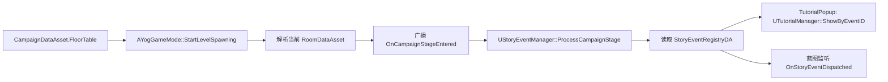

# 故事事件引擎接口说明

## 目标

故事事件引擎用于连接“全局关卡流程”和“教程/剧情/事件表现”。

它不替代 `RoomDataAsset`，也不决定房间怎么刷怪。它只监听 `CampaignDataAsset.FloorTable` 中的阶段标签，并根据配置触发对应事件。

当前第一版主要服务教程：

- 进入某个全局阶段时触发教程弹窗。
- 教程完成后可跳过只在第一局出现的事件。
- 保留蓝图广播，后续可以扩展成剧情、镜头、字幕、奖励、锁门等事件。

## 数据来源

故事事件来自 `CampaignDataAsset.FloorTable`。

| 字段 | 说明 |
| --- | --- |
| `GlobalStageTag` | 当前阶段是什么，例如 `Level.Stage.FirstCombat` |
| `StoryEventTags` | 当前阶段要触发哪些事件，例如 `Tutorial.CardConsume` |

运行时 `AYogGameMode::StartLevelSpawning()` 会在解析出当前 `RoomDataAsset` 后广播：

| 接口 | 用途 |
| --- | --- |
| `OnCampaignStageEntered` | 蓝图可绑定的阶段进入事件 |
| `GetActiveGlobalStageTag()` | 查询当前全局阶段 |
| `GetActiveStoryEventTags()` | 查询当前阶段事件标签 |
| `HasActiveStoryEventTag(Tag)` | 查询当前阶段是否带某个事件标签 |

## 故事事件注册表

新增资产类型：

`StoryEventRegistryDA`

建议命名：

`DA_StoryEventRegistry_MainRun`

它的 `Entries` 数组用于把 `StoryEventTags` 映射到具体行为。

| 字段 | 说明 |
| --- | --- |
| `EventTag` | 要监听的事件标签，例如 `Tutorial.CardConsume` |
| `ActionType` | 当前支持 `TutorialPopup` 和 `None` |
| `TutorialEventID` | 触发教程弹窗时传给 `UTutorialManager::ShowByEventID` 的 ID |
| `bPauseGame` | 教程弹窗是否暂停游戏 |
| `bOnlyWhenTutorialIncomplete` | 教程已完成时是否跳过 |
| `bFireOncePerRun` | 本局内是否只触发一次 |
| `DesignerNote` | 策划备注，不影响运行时 |

## GameMode 接口

`AYogGameMode` 增加两个配置项：

| 字段 | 说明 |
| --- | --- |
| `StoryEventRegistry` | 当前 Campaign 使用的故事事件注册表 |
| `bDispatchStoryEventsFromCampaign` | 是否在进入 `FloorTable` 阶段时自动分发故事事件 |

推荐配置：

- 正式游戏 GameMode：开启 `bDispatchStoryEventsFromCampaign`。
- 单房间测试地图：可以关闭，避免测试时弹教程。

## 运行时流程

## 教程弹窗配置示例

`CampaignDataAsset.FloorTable[1]`：

| 字段 | 值 |
| --- | --- |
| `GlobalStageTag` | `Level.Stage.FirstCombat` |
| `StoryEventTags` | `Tutorial.CardConsume` |

`DA_StoryEventRegistry_MainRun.Entries`：

| 字段 | 值 |
| --- | --- |
| `EventTag` | `Tutorial.CardConsume` |
| `ActionType` | `TutorialPopup` |
| `TutorialEventID` | `tutorial_card_consume` |
| `bPauseGame` | `true` |
| `bOnlyWhenTutorialIncomplete` | `true` |
| `bFireOncePerRun` | `true` |

`TutorialRegistryDA`：

| Key | Value |
| --- | --- |
| `tutorial_card_consume` | 对应的 `DialogContentDA` 教程内容 |

这样玩家进入第一战阶段时，流程会自动触发 `tutorial_card_consume` 教程弹窗。

## 和关卡编辑器的关系

关卡编辑器只负责填写数据。

故事事件引擎只负责读取这些数据并触发事件。

两者通过以下字段连接：

| 编辑器字段 | 运行时接口 |
| --- | --- |
| `FloorTable.GlobalStageTag` | `AYogGameMode::GetActiveGlobalStageTag()` |
| `FloorTable.StoryEventTags` | `AYogGameMode::GetActiveStoryEventTags()` |
| `StoryEventRegistry` | `UStoryEventManager::SetRegistry()` |

这意味着教程不会和具体房间细则耦合。以后同一个 `Tutorial.CardConsume` 可以放在不同 Campaign 的不同阶段，只要全局流程表填写正确即可。

## 后续扩展

当前第一版只做教程弹窗。后续可以在 `EStoryEventActionType` 中扩展：

- `InfoPopup`：普通信息提示。
- `StartLevelFlow`：播放 LevelFlow 节点图。
- `CameraSequence`：播放镜头。
- `GrantReward`：给局内或局外资源。
- `SetFlag`：设置故事进度标记。
- `BlueprintOnly`：只广播，不做 C++ 内置行为。
