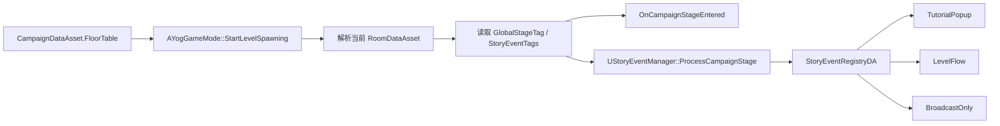

# 故事事件引擎接口说明

## 目标

故事事件引擎用于把“全局关卡流程”连接到“教程、剧情、镜头、提示、关卡脚本表现”。

它不替代 `RoomDataAsset`，也不决定房间怎么刷怪。房间内容仍由 `RoomDataAsset` 控制；故事事件只监听 `CampaignDataAsset.FloorTable` 中的阶段标签，并根据注册表触发对应行为。

## 当前支持的行为

`StoryEventRegistryDA.Entries[].ActionType` 当前支持：

| ActionType | 用途 |
| --- | --- |
| `BroadcastOnly` | 只广播 `OnStoryEventDispatched`，由蓝图自行处理 |
| `TutorialPopup` | 调用 `UTutorialManager::ShowByEventID` 展示教程弹窗 |
| `LevelFlow` | 启动一个 `ULevelFlowAsset`，可组合教程、延迟、信息弹窗等节点 |
| `None` | 空行为，主要用于临时占位 |

推荐优先级：

1. 简单教程弹窗用 `TutorialPopup`。
2. 多步骤表现、延迟、镜头、组合弹窗用 `LevelFlow`。
3. 需要蓝图自定义处理时用 `BroadcastOnly`。

## 数据来源

故事事件来自 `CampaignDataAsset.FloorTable`。

| 字段 | 说明 |
| --- | --- |
| `GlobalStageTag` | 当前阶段是什么，例如 `Level.Stage.FirstCombat` |
| `StoryEventTags` | 当前阶段要触发哪些事件，例如 `Tutorial.CardConsume` |

运行时 `AYogGameMode::StartLevelSpawning()` 会在解析出当前 `RoomDataAsset` 后广播并分发故事事件。

| 接口 | 用途 |
| --- | --- |
| `OnCampaignStageEntered` | 蓝图可绑定的阶段进入事件 |
| `GetActiveGlobalStageTag()` | 查询当前全局阶段 |
| `GetActiveStoryEventTags()` | 查询当前阶段事件标签 |
| `HasActiveStoryEventTag(Tag)` | 查询当前阶段是否带某个事件标签 |

## 故事事件注册表

新增资产类型：

`StoryEventRegistryDA`

建议路径：

`/Game/Data/Story/DA_StoryEventRegistry_MainRun`

`Entries` 数组字段说明：

| 字段 | 说明 |
| --- | --- |
| `EventTag` | 要监听的事件标签，例如 `Tutorial.CardConsume` |
| `ActionType` | 触发行为类型 |
| `TutorialEventID` | `TutorialPopup` 使用，传给 `UTutorialManager::ShowByEventID` |
| `bPauseGame` | 教程弹窗是否暂停游戏 |
| `LevelFlow` | `LevelFlow` 使用，填写要启动的 `ULevelFlowAsset` |
| `bStopExistingStoryFlow` | 启动新 LevelFlow 前是否停止当前故事 Flow |
| `bOnlyWhenTutorialIncomplete` | 教程已完成时跳过，适合第一局教程 |
| `bFireOncePerRun` | 本局内只触发一次 |
| `DesignerNote` | 策划备注，不影响运行时 |

## GameMode 配置

`AYogGameMode` 提供两个配置项：

| 字段 | 说明 |
| --- | --- |
| `StoryEventRegistry` | 当前 Campaign 使用的故事事件注册表 |
| `bDispatchStoryEventsFromCampaign` | 是否在进入 `FloorTable` 阶段时自动分发故事事件 |

推荐配置：

- 正式 GameMode：开启 `bDispatchStoryEventsFromCampaign`，并填写 `StoryEventRegistry`。
- 单房间测试地图：可以关闭 `bDispatchStoryEventsFromCampaign`，避免测试时弹教程。

## 运行时流程

新跑局开始时，`UStoryEventManager` 会重置本局内的 `bFireOncePerRun` 记录。

## 使用方式：教程弹窗

### 1. 在 Campaign 阶段填标签

`CampaignDataAsset.FloorTable[1]`：

| 字段 | 值 |
| --- | --- |
| `GlobalStageTag` | `Level.Stage.FirstCombat` |
| `StoryEventTags` | `Tutorial.CardConsume` |

### 2. 在 StoryEventRegistryDA 中注册事件

`DA_StoryEventRegistry_MainRun.Entries`：

| 字段 | 值 |
| --- | --- |
| `EventTag` | `Tutorial.CardConsume` |
| `ActionType` | `TutorialPopup` |
| `TutorialEventID` | `tutorial_card_consume` |
| `bPauseGame` | `true` |
| `bOnlyWhenTutorialIncomplete` | `true` |
| `bFireOncePerRun` | `true` |

### 3. 在 TutorialRegistryDA 中配置弹窗内容

| Key | Value |
| --- | --- |
| `tutorial_card_consume` | 对应的 `DialogContentDA` 教程内容 |

结果：玩家进入第一战阶段时，自动弹出 `tutorial_card_consume` 教程。

## 使用方式：LevelFlow 剧情

### 1. 创建 LevelFlow

创建一个 `Level Event Flow` 资产，例如：

`LFA_Tutorial_CardConsume`

里面可以使用已有 LevelFlow 节点：

- `LENode_ShowTutorial`
- `LENode_ShowInfoPopup`
- `LENode_Delay`
- `LENode_WaitForLootSelected`

### 2. 注册到故事事件

`DA_StoryEventRegistry_MainRun.Entries`：

| 字段 | 值 |
| --- | --- |
| `EventTag` | `Story.FirstCombat.Intro` |
| `ActionType` | `LevelFlow` |
| `LevelFlow` | `LFA_Tutorial_CardConsume` |
| `bStopExistingStoryFlow` | `true` |
| `bOnlyWhenTutorialIncomplete` | `true` |
| `bFireOncePerRun` | `true` |

### 3. 在 Campaign 阶段填事件

`FloorTable` 对应阶段的 `StoryEventTags` 添加：

`Story.FirstCombat.Intro`

结果：进入该阶段时，故事引擎会启动 `LFA_Tutorial_CardConsume`。

## 使用方式：蓝图自定义事件

如果 C++ 不需要内置行为：

| 字段 | 值 |
| --- | --- |
| `ActionType` | `BroadcastOnly` |

然后在蓝图中监听：

- `UStoryEventManager.OnStoryEventDispatched`
- `UStoryEventManager.OnStoryEventSkipped`

蓝图可以根据 `FStoryEventRuntimeContext` 读取：

- `FloorIndex`
- `StageTag`
- `EventTag`
- `RoomData`
- `ActionType`
- `Result`
- `ResolvedTutorialEventID`
- `ResolvedLevelFlow`

## 和关卡编辑器的关系

关卡编辑器负责填写数据，故事事件引擎负责读取并执行。

| 编辑器字段 | 运行时接口 |
| --- | --- |
| `FloorTable.GlobalStageTag` | `AYogGameMode::GetActiveGlobalStageTag()` |
| `FloorTable.StoryEventTags` | `AYogGameMode::GetActiveStoryEventTags()` |
| `StoryEventRegistry` | `UStoryEventManager::SetRegistry()` |

这样教程不会和具体房间细则耦合。同一个 `Tutorial.CardConsume` 可以放在不同 Campaign 的不同阶段，只要全局流程表填写正确即可。

## 第一局教程推荐标签

| 阶段 | `GlobalStageTag` | `StoryEventTags` |
| --- | --- | --- |
| 主城准备 | `Level.Stage.Hub` | `Tutorial.StartingLoadout` |
| 第一战 | `Level.Stage.FirstCombat` | `Tutorial.CardConsume` |
| 洗牌教学 | `Level.Stage.ShuffleRoom` | `Tutorial.Shuffle` |
| 奖励教学 | `Level.Stage.Reward` | `Tutorial.RewardToDeck` |
| 连携教学 | `Level.Stage.LinkCard` | `Tutorial.LinkCard` |
| 终结技教学 | `Level.Stage.Finisher` | `Tutorial.Finisher` |
| 路线选择 | `Level.Stage.RouteChoice` | `Tutorial.RouteRewardChoice` |
