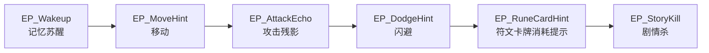

# Story Encounter 剧情教学工作台使用说明

> 版本：v1.0 | 2026-05-21
> 适用：教程、剧情触发点、弱引导、首局前记忆碎片、关卡内剧情点配置
> 编辑器入口：`Tools -> DevKit Tools -> 剧情工具 -> 剧情教学工作台`

---

## 一、这个工作台解决什么问题

剧情教学工作台只负责“游戏内会发生什么、以什么顺序组织、玩家什么时候触发”。

它不负责外部 SOP、制作排期、放置清单、验收清单。这些内容放在外部表格或项目管理工具里维护。

在 UE 里，这个工作台只保留三件事：

| 内容 | 作用 |
|------|------|
| `剧情教学流程图` | 表达教程 / 剧情点之间的顺序、关系和策划结构 |
| `剧情点DA` | 配置一个具体剧情点真正发生什么 |
| `AStoryEncounterTrigger` | 放在关卡中，决定玩家什么时候触发某个剧情点 |

---

## 二、核心概念

### 1. 流程图：负责“结构”

流程图是给策划看的结构图。

它回答：

- 这段教程从哪里开始？
- 玩家先经历哪个提示，再经历哪个事件？
- 哪些剧情点属于同一段流程？
- 教程 / 剧情是否有分支或条件？

流程图本身不直接代表关卡中的触发体。它更像“剧情和教程的路线图”。

### 2. 剧情点DA：负责“内容”

剧情点 DA 是一个真正会被执行的内容资产。

它回答：

- 玩家触发这个点时看到什么提示？
- 是否播放对话？
- 是否记录进度？
- 是否解锁功能？
- 是否播放 LevelFlow 演出？

关卡触发器最终绑定的是剧情点 DA。

### 3. 图节点：负责“把流程图和剧情点DA连起来”

流程图里的每个节点都应该绑定一个剧情点 DA。

图节点只负责在画布上显示和连接，真正执行的内容在 `Point` 字段绑定的剧情点 DA 里。

### 4. 关卡触发器：负责“玩家什么时候触发”

在关卡里放置 `AStoryEncounterTrigger`，把它的 `EncounterPoint` 设置为某个剧情点 DA。

玩家进入触发器后，会执行这个剧情点 DA 的 Actions。

---

## 三、编辑器界面介绍

打开 `剧情教学工作台` 后，界面分为三列。

```text
┌────────────────────┬──────────────────────────────┬────────────────────┐
│ 左侧资产区          │ 中间流程画布                  │ 右侧属性 / 校验      │
├────────────────────┼──────────────────────────────┼────────────────────┤
│ 流程图资产          │ 默认灰色禁用画布              │ 选中对象属性         │
│ 剧情点DA            │ 选中流程图后切换为可编辑画布  │ 校验结果             │
└────────────────────┴──────────────────────────────┴────────────────────┘
```

### 左侧：流程图资产

显示当前项目里的 `UStoryEncounterGraph` 资产。

选中一张流程图后，中间画布会切换到这张图。

### 左侧：剧情点DA

显示当前项目里的 `UStoryEncounterPointDA` 资产。

按钮 `新建剧情点DA` 会创建一个新的剧情点 DA。选中后可以在右侧属性面板编辑。

### 中间：流程画布

未选择流程图时，画布默认显示为灰色禁用态。

选中左侧某张流程图后，画布会切换为可编辑状态。可以在画布中右键创建节点，并拖拽连线。

### 右侧：属性

右侧显示当前选中对象的 Details：

- 选中流程图：编辑流程图基础信息
- 选中画布节点：编辑节点绑定的 `Point`
- 选中剧情点 DA：编辑剧情点内容
- 选中连线：编辑连线文本和条件

### 右侧：校验

校验区会提示常见配置问题，例如：

- 剧情点 DA 缺少 `EncounterId`
- 剧情点 DA 缺少 `NodeId`
- 流程图节点没有绑定剧情点 DA
- 剧情点 DA 没有任何 Actions

---

## 四、标准使用流程

### 第一步：创建流程图

在工作台顶部点击 `新建流程图`。

建议命名：

```text
EG_MemoryTutorial_PreRun
EG_FirstRun_RuneTutorial
EG_Hub_NightGirlIntro
```

命名规则建议：

| 前缀 | 含义 |
|------|------|
| `EG_` | Encounter Graph，剧情教学流程图 |
| `MemoryTutorial` | 所属教程或剧情段 |
| `PreRun` | 具体阶段 |

### 第二步：创建剧情点DA

点击 `新建剧情点DA`，为流程中的每个实际事件创建一个 DA。

建议命名：

```text
EP_Wakeup
EP_MoveHint
EP_AttackEcho
EP_DodgeHint
EP_RuneCardHint
EP_StoryKill
```

命名规则建议：

| 前缀 | 含义 |
|------|------|
| `EP_` | Encounter Point，剧情点 |
| 后缀 | 说明这个点的作用 |

### 第三步：编辑剧情点DA

选中剧情点 DA，在右侧属性面板填写：

| 字段 | 填写方式 |
|------|---------|
| `EncounterId` | 同一段流程保持一致，例如 `MemoryTutorial_PreRun` |
| `NodeId` | 稳定英文 ID，例如 `wake_up`、`move_hint` |
| `DisplayName` | 中文策划名，例如 `记忆碎片苏醒` |
| `Kind` | 类型，例如区域、物件、NPC、系统、死亡、功能 |
| `PlayerFacingEvent` | 玩家在这里看见或做了什么 |
| `FirePolicy` | 教程通常用 `Once` |
| `Condition` | 触发条件，可先留默认 |
| `Actions` | 触发后执行的内容 |

`EncounterId + NodeId` 应该稳定，不要频繁改名。它会参与进度记录和校验。

### 第四步：在流程图中创建节点

左侧选中流程图，中间画布会变成可编辑状态。

在画布里：

1. 右键创建剧情点节点。
2. 选中节点。
3. 在右侧 Details 中找到 `Point`。
4. 把对应的剧情点 DA 绑定进去。
5. 拖拽节点之间的连线表达顺序。

示例：

```text
EP_Wakeup -> EP_MoveHint -> EP_AttackEcho -> EP_DodgeHint -> EP_RuneCardHint -> EP_StoryKill
```

### 第五步：在关卡里放触发器

在关卡中放置 `AStoryEncounterTrigger`。

在 Details 中设置：

| 字段 | 填写 |
|------|------|
| `EncounterPoint` | 选择对应剧情点 DA |

玩家进入触发器后，会执行该剧情点 DA 的 Actions。

旧字段 `EncounterMap + NodeId` 是兼容旧资产用的，新流程优先使用 `EncounterPoint`。

---

## 五、Actions 使用说明

剧情点 DA 的 `Actions` 是这个剧情点真正执行的内容。

| Action | 用途 | 适合场景 |
|--------|------|----------|
| `WeakHint` | 显示弱提示 | 移动、攻击、闪避、符文卡牌消耗等轻引导 |
| `Dialogue` | 显示对话或旁白 | 黑夜少女、记忆残响、环境叙事 |
| `RecordProgress` | 记录玩家已经历某点 | 防止重复提示、控制后续条件 |
| `UnlockFeature` | 解锁功能 | 解锁炼金、神秘学、灵视等 |
| `SetQuestObjective` | 设置任务目标 | 后续接任务系统时使用 |
| `PlayLevelFlow` | 播放复杂流程 | 镜头、刷敌、锁门、剧情杀、传送 |
| `TeleportToNode` | 预留跳转 | 当前不建议作为主要流程驱动 |

### 推荐组合

普通教程提示：

```text
WeakHint
RecordProgress
```

剧情演出：

```text
Dialogue
PlayLevelFlow
RecordProgress
```

功能解锁：

```text
Dialogue
UnlockFeature
RecordProgress
```

---

## 六、第一局前记忆碎片教程示例

建议先做一个流程图：

```text
EG_MemoryTutorial_PreRun
```

剧情点 DA 示例：

| 剧情点DA | NodeId | 玩家体验 | 推荐 Actions |
|----------|--------|----------|--------------|
| `EP_Wakeup` | `wake_up` | 玩家作为记忆碎片苏醒 | `Dialogue` + `RecordProgress` |
| `EP_MoveHint` | `move_hint` | 玩家穿过残破通道 | `WeakHint` |
| `EP_AttackEcho` | `attack_echo` | 玩家攻击战斗残影 | `WeakHint` + `RecordProgress` |
| `EP_DodgeHint` | `dodge_hint` | 玩家躲避红光前摇 | `WeakHint` |
| `EP_RuneCardHint` | `rune_card_hint` | 提示攻击会消耗符文卡牌能力 | `WeakHint` + `RecordProgress` |
| `EP_StoryKill` | `story_kill` | 骑士团成员剧情杀玩家 | `Dialogue` + `PlayLevelFlow` + `RecordProgress` |

流程图连接：



关卡放置：

| 关卡位置 | Trigger 绑定 |
|----------|--------------|
| 苏醒点 | `EP_Wakeup` |
| 移动通道 | `EP_MoveHint` |
| 战斗残影附近 | `EP_AttackEcho` |
| 敌人红光教学区 | `EP_DodgeHint` |
| 符文卡牌提示点 | `EP_RuneCardHint` |
| Boss 剧情杀区域 | `EP_StoryKill` |

---

## 七、配置原则

### 1. 弱引导优先

优先让玩家通过场景、敌人动作、空间布局理解玩法。

`WeakHint` 只补一句轻提示，不要把教程做成大量弹窗。

### 2. 流程图表达策划意图

流程图应该能让人一眼看懂这段体验：

- 起点是什么？
- 玩家学了什么？
- 剧情情绪如何推进？
- 哪些点对应关卡触发？

### 3. 剧情点 DA 要可复用、可放置

每个剧情点 DA 最好对应一个清晰事件，不要把整段教程都塞进一个 DA。

好的粒度：

```text
移动提示
攻击残影
闪避提示
剧情杀
```

不推荐：

```text
第一局前全部教程
```

### 4. 复杂逻辑交给 LevelFlow

剧情点 DA 只负责触发结果列表。

如果需要：

- 生成敌人
- 控制镜头
- 锁门
- 播放动画
- 剧情杀
- 传送

就用 `PlayLevelFlow` 接一个 LevelFlowAsset。

---

## 八、当前限制

当前版本中，流程图主要用于“可视化组织和配置检查”。

运行时真正触发的是关卡中的 `AStoryEncounterTrigger -> EncounterPoint`。

也就是说：

- 流程图连线不会自动让游戏按整条线跑完。
- 玩家触发哪个剧情点，取决于关卡中哪个触发器被碰到。
- 分支和条件可以先在图上表达，复杂运行逻辑建议用 LevelFlow 或后续扩展的图执行器。

---

## 九、常见问题

### Q：为什么要有剧情点 DA，不能直接在图节点里写内容？

因为关卡触发器需要引用一个稳定资产。

图节点负责“看结构”，剧情点 DA 负责“可执行内容”。这样同一个剧情点既能出现在流程图里，也能被关卡触发器直接绑定。

### Q：为什么 SOP 和放置清单不在工作台里？

这些属于生产管理，不属于游戏运行配置。

当前工作台只做流程制作，避免策划在 UE 里同时维护两套项目管理信息。

### Q：我应该先建流程图还是先建剧情点 DA？

两种都可以。

推荐先建流程图，确定这段体验有哪些节点，再逐个创建剧情点 DA。

### Q：一个剧情点 DA 可以被多个触发器引用吗？

可以，但教程中建议谨慎使用。

如果两个关卡位置需要不同文本或不同条件，应该拆成两个剧情点 DA。

### Q：RecordProgress 的 ProgressKey 怎么写？

写稳定英文，例如：

```text
wake_up_seen
attack_echo_done
rune_card_hint_seen
```

系统会自动生成隐藏进度 Tag：

```text
Story.Encounter.Progress.<EncounterId>.<ProgressKey>
```

---

## 十、推荐目录

建议资产放在：

```text
/Game/Story/Encounters/
  EG_MemoryTutorial_PreRun

/Game/Story/EncounterPoints/
  EP_Wakeup
  EP_MoveHint
  EP_AttackEcho
  EP_DodgeHint
  EP_RuneCardHint
  EP_StoryKill

/Game/Story/LevelFlows/
  LF_StoryKill_KnightOrder
```

---

## 十一、最小可用配置清单

一段教程至少需要：

- 一张 `剧情教学流程图`
- 若干个 `剧情点DA`
- 每个流程图节点绑定一个剧情点 DA
- 关卡里若干个 `AStoryEncounterTrigger`
- 每个触发器设置 `EncounterPoint`
- 每个剧情点 DA 至少有一个 Action

完成这些后，玩家进入触发器即可看到教程 / 剧情反馈。
