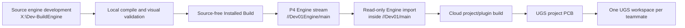

# Project Guide

This guide captures current project direction and working assumptions. `AGENTS.md` asks Codex to read this file before starting repository work.

## Engine, P4, Cloud Build, and UGS Distribution

Dev01 uses a customized UE 5.8 source engine, but UGS clients do **not** receive or build the complete engine source. The development and distribution chain is:



The core boundary is:

- The local workstation develops, compiles, visually validates, and publishes the customized UE 5.8 engine.
- P4 stores the complete project, the source-free Installed Build, the UGS PCB, and the UGS self-update package.
- The cloud build agent uses the imported Installed Build to compile project and plugin modules. It does not rebuild the complete Unreal Engine.
- GitHub carries project code and approved text files only. It must not receive Unreal Engine source, project assets, Engine binaries, PCB archives, or generated build output.
- Teammates use UGS and one personal main workspace. They do not need engine source, a separate Engine workspace, or a local DevKitEditor build.

### Authoritative Roots and Roles

| Role | Path or depot | Rule |
| --- | --- | --- |
| Editable UE 5.8 source | `X:\Dev-BuildEngine` | The only authoritative engine source tree. Renderer, Shader, material-interface, stylized-lighting, and UGS source changes belong here. |
| Project Git worktree | `X:\Project\Dev01` | Project code collaboration and GitHub-side maintenance. Do not publish complete Engine source to GitHub. |
| Local P4/UGS validation workspace | `X:\Project\YogProject\Dev01` | Complete project plus the read-only imported source-free Engine. Use it for P4/UGS acceptance, not engine-source development. |
| Local UGS checkout/install | `X:\Project\YogProject\UnrealGameSync` | UGS client and local self-update validation. |
| Local release pipeline | `X:\Dev-BuildPipeline\Dev01` | Builds and prepares the source-free Installed Build and its release metadata. |
| Canonical Installed Build output | `X:\Dev-InstalledBuilds\UE_5.8_Dev01\Windows` | Local source-free engine product before publication. |
| Isolated Engine publish stage | `X:\Dev-EnginePublishStage\UE_5.8_Dev01\Engine` | Exact Engine payload staged for P4 publication. |
| Cloud P4 workspace | `C:\Project\Dev01-P4` | Cloud-side project sync and project/plugin compilation. |
| Cloud build automation | `C:\BuildAgent\Dev01` | Project build, validation, PCB packaging, and publication entrypoints. |

`X:\Project\YogProject\Dev01\Engine` is **not** the editable source engine. It is the source-free Installed Build imported for UGS. Never make engine feature changes there and never treat its files as the authoritative source of Renderer or Shader work.

### P4 Layout

| Depot path | Contents |
| --- | --- |
| `//Dev01/main` | Complete Dev01 project, code, configuration, assets, UGS configuration, and release metadata. |
| `//Dev01Engine/main` | Source-free UE 5.8 Installed Build used by the project and UGS clients. |
| `//Dev01Binaries/UGS/++Dev01+main-Editor.zip` | Precompiled project and project-plugin Editor binaries (PCB). It does not contain the complete Engine again. |
| `//Dev01Binaries/Tools/UnrealGameSync/Release.zip` | UGS installer/self-update package. |

The project stream must import an explicit Engine changelist:

```text
import Engine/... //Dev01Engine/main/...@<EngineCL>
```

Never change this to follow `#head`. The project changelist, imported Engine changelist, PCB code changelist, and BuildId must remain traceable as one tested release set.

### Choosing the Correct Engine

For engine feature, Renderer, Shader, material-interface, or stylized-lighting work, compile and launch the source engine:

```powershell
& 'X:\Dev-BuildEngine\Engine\Build\BatchFiles\Build.bat' DevKitEditor Win64 Development '-Project=X:\Project\YogProject\Dev01\DevKit.uproject' -WaitMutex
& 'X:\Dev-BuildEngine\Engine\Binaries\Win64\UnrealEditor.exe' 'X:\Project\YogProject\Dev01\DevKit.uproject'
```

Do not launch `X:\Project\YogProject\Dev01\Engine\Binaries\Win64\UnrealEditor.exe` to develop or compile full engine-source changes. That executable is the UGS/Installed Build version and is appropriate only for distribution acceptance and teammate-equivalent testing.

Before an engine release, use the source engine to open `X:\Project\YogProject\Dev01\DevKit.uproject` and manually validate the requested rendering or gameplay effect. Confirm that there are no module-version errors, Shader failures, crashes, or broken asset references before starting publication.

### Engine Release Flow

An engine-source or engine-Shader update requires the full chain below:

1. Inspect both source-engine Git state and project P4 state. Preserve unrelated local changes and identify ownership before staging or opening files.
2. Modify and compile only in `X:\Dev-BuildEngine`.
3. Open `DevKit.uproject` with the source-engine `UnrealEditor.exe` and complete visual/runtime acceptance locally.
4. Validate the local release pipeline:

   ```powershell
   powershell -ExecutionPolicy Bypass -File X:\Dev-BuildPipeline\Dev01\test_dev01_release_pipeline.ps1
   ```

5. Generate the Installed Build:

   ```powershell
   powershell -ExecutionPolicy Bypass -File X:\Dev-BuildPipeline\Dev01\start_ue58_installed_build.ps1
   ```

6. Publish the isolated, source-free Engine payload to a new submitted changelist under `//Dev01Engine/main`.
7. Verify the Engine payload and its BuildId, then pin `//Dev01/main` to that exact Engine changelist and update the project release marker.
8. Let the cloud build agent sync the pinned project and compile DevKit, DevKitEditor, DevKitShaders, and all formal project/plugin Runtime and Editor modules with the Installed Build.
9. Publish a matching PCB to `//Dev01Binaries/UGS/++Dev01+main-Editor.zip`, then run `p4 verify -q` on the archive.
10. Use a clean teammate-equivalent UGS workspace to sync, download the PCB, and open the project without compiling locally. Save the UGS state/log and editor startup log as acceptance evidence.

The Installed Build includes the Editor executable and engine DLLs, runtime Content, `.usf`/`.ush` Shader sources, Python runtime, required public headers/BuildRules, and Installed Build/version metadata. It must exclude the complete private Engine source tree, Epic Git history, local caches/Saved data, unnecessary Intermediate output, and debug PDBs not explicitly required by the release contract.

`X:\Dev-BuildPipeline\Dev01\README.md` documents the local binary pipeline. Some of its project-PCB stages are retained for bootstrap/audit history; the production project/plugin build and PCB publication are cloud responsibilities. Do not combine the local legacy PCB flow with the cloud flow unless the release procedure has been deliberately reconciled and revalidated.

### Project-Only Update Flow

Project or project-plugin code changes do not require a new Engine publication:

```text
GitHub/P4 project code update
-> cloud project/plugin compile
-> matching PCB publication
-> UGS update and launch validation
```

Do not rebuild or republish `//Dev01Engine/main` unless the Engine payload, engine Shader source, or the Engine/project binary contract actually changed.

### Cloud Build and PCB Contract

The cloud server at `124.223.187.156` is the P4 authority, project build node, and UGS distribution node. Its routine build must use the published Installed Build and must not compile the complete Unreal Engine source.

Current cloud entrypoints are expected under `C:\BuildAgent\Dev01`, including:

```powershell
powershell -ExecutionPolicy Bypass -File C:\BuildAgent\Dev01\dev01_ci_project_build.ps1 -Force
powershell -ExecutionPolicy Bypass -File C:\BuildAgent\Dev01\dev01_publish_ugs_binaries.ps1
```

The known stable project-build policy is low concurrency with `-MaxParallelActions=2`, `-NoUBA`, and `-UsePrecompiled`. Treat the actual cloud scripts and their logs as authoritative for a production run; if cloud access is unavailable, do not claim the current task, scheduler, disk, cache, or BuildId gate has been independently verified.

The PCB contains project and project-plugin binary output such as `Binaries/Win64`, `Plugins/*/Binaries/Win64`, and required platform binary folders. It must not package the complete Engine. `Build/UnrealGameSync.ini` provides the authoritative `ZippedBinariesPath`.

The PCB depot changelist description must contain the UGS-recognized code/project changelist, for example:

```text
[CL 00000083] Cloud-built DevKitEditor ...
```

The PCB depot changelist, the bracketed UGS code changelist, and the Engine changelist are different concepts and do not have to be the same number.

### BuildId Invariant

The authoritative BuildId comes from:

```text
Engine\Binaries\Win64\UnrealEditor.modules
```

The same BuildId must appear in all formal release manifests, including:

- `Binaries\Win64\DevKitEditor.target` under `Version.BuildId`.
- `Binaries\Win64\UnrealEditor.modules`.
- Every formal `Plugins\...\Binaries\Win64\UnrealEditor.modules` included in the PCB.

The cloud build and publish scripts must restore authoritative P4 Engine manifests, normalize project/plugin metadata after compilation, scan every formal module manifest, and refuse publication on any mismatch. A “Missing DevKit Modules” or “built with a different engine version” dialog is normally a release-contract failure between Engine and PCB; do not click **Yes** and rebuild locally as the teammate fix.

### Teammate UGS Workflow

Each teammate should have one personal P4 user/ticket and one personal main workspace. The normal workflow is:

1. Install P4V and authenticate to P4.
2. Run `SetupDev01UGS.bat` or use `Dev01_Menu.bat` from the workspace.
3. Let UGS sync `//Dev01/main`, including the Engine imported at the pinned changelist.
4. Let UGS select and unpack the PCB that matches the selected project/code changelist.
5. Launch `<Workspace>\Engine\Binaries\Win64\UnrealEditor.exe` and open `<Workspace>\DevKit.uproject`.

Teammates should not need the Engine source, Visual Studio engine compilation, a second Engine workspace, manual DLL copying, or local recovery builds.

UGS prevents a second launch of the same project while its Editor is starting or running. It activates the existing window instead, protecting the exclusive `Saved/Search/FileInfo.db` Asset Search database from cross-process contention and repeated `disk I/O error` logging.

### GitHub and P4 Boundary

- P4 is authoritative for the complete Unreal project, assets, `Build/` release metadata, the Installed Engine, and PCB archives.
- GitHub is the project code/text collaboration mirror. Synchronization must be whitelist-based and dry-run/audit capable.
- GitHub-eligible content may include `Source`, approved `Config`, project/plugin source, text build scripts, and reviewed documentation.
- Never upload `Engine`, `Content` assets, `Binaries`, `Intermediate`, `Saved`, PCB ZIP files, or complete Unreal Engine source/binaries to the project GitHub repository.
- Git-to-P4 reconciliation must not delete P4-only UGS configuration, Engine import state, assets, or release markers.

### Distribution Maintenance Safety

Before any Engine, project-stream, cloud-build, PCB, UGS, or Git/P4 bridge maintenance:

1. Run `p4 opened`, inspect pending changelists, and run `p4 resolve -n` where relevant.
2. Confirm the current `//Dev01/main` head, `//Dev01Engine/main` head, pinned Engine import, PCB revision/description, and release marker.
3. Inspect Git status in every source worktree that will participate. Never mix unrelated user changes into a maintenance commit or changelist.
4. Do not create a new numbered changelist until existing opened files and ownership are understood. Do not place maintenance files into a default changelist that already contains unrelated assets.
5. Do not submit, sync over, revert, delete, or reconcile unrelated user work.
6. Distribution maintenance does not authorize changes to character rendering, stylized lighting, gameplay, or content assets. Make those changes only under a separate explicit feature request and validate them first in the source engine.

The project currently uses `Build/Dev01EngineRelease.txt` as its checked local release marker. Some older pipeline documentation refers to `Build/Dev01EngineRelease.json`; do not recreate, delete, or switch marker formats implicitly. Reconcile and version the marker contract deliberately before the next Engine release.

### Verified Distribution Snapshot (2026-07-19)

This is a dated checkpoint, not a permanent configuration. Refresh it from live P4 and local manifests before every release:

- Project head: `//Dev01/main` CL83.
- Engine head: `//Dev01Engine/main` CL76.
- Project Engine import: `Engine/... <- //Dev01Engine/main/...@76`.
- Project release marker: `Build/Dev01EngineRelease.txt`, pinned Engine CL76.
- PCB: `//Dev01Binaries/UGS/++Dev01+main-Editor.zip#12`, submitted in P4 CL84 for `[CL 00000083]`.
- UGS self-update: `//Dev01Binaries/Tools/UnrealGameSync/Release.zip#8`, P4 CL85. This release prevents duplicate same-project Editor launches and writes BOM-free `Deployment.json` metadata.
- Engine, DevKitEditor target, project modules, and scanned formal plugin modules use BuildId `792eec68-5f82-4e2f-852a-66474164b377`.
- Source engine: branch `5.8`, Git HEAD `6673776aad735f49a5ce3bbed474ffcc701e7a8e`, with local engine/Shader/UGS modifications present; preserve them as authoritative local work.
- The local P4 default changelist contained unrelated character-material, outline, lighting-built-data, and test-map assets during this check. It was not used for this guide update, and no numbered changelist was created.

## Current Direction

- Player combat input is now four independent actions: Attack, Skill, WeaponSkill, and Dash.
- Skill is the player-selected active skill handled by `PlayerActiveSkillComponent` / `ActiveSkillDataAsset`; do not route it through the deprecated SpecialAttack system.
- Attack and WeaponSkill runtime input should activate the broad action tags only. Legacy Combo1-4 tags remain for montage-row compatibility and asset migration, but they should not drive card finisher logic or direct input combo chaining.
- ComboGraph is no longer part of the player runtime combat path. Keep old graph fields/classes only as asset-load compatibility until legacy assets are migrated and resaved.

## GameplayTag Cleanup Direction

- Current tag reorganization direction is documented in `Docs/04_开发实现与系统文档/标签/GameplayTag_ReorgPlan_LOTF.md`.
- Treat LOTF as an engineering-governance reference, not a root-name template: keep authoritative config dictionaries, add redirects for renames, split high-churn `GameState.Flags.*`, and use code-side tag constants/native handles for core runtime tags.
- `Buff.*` is the formal top-level system for buff/debuff/status-effect semantics and the merged card/rune effect vocabulary. Use flat tags such as `Buff.Fire`, `Buff.Poison`, `Buff.Moonlight`, `Buff.WeaponSkillFinisher`, and only add child tags when the child is a real sub-effect such as `Buff.Fire.Explode`.
- Do not introduce `Buff.Status.*`, `Buff.ID.*`, `Buff.Keyword.*`, `Buff.Binding.*`, `Rune.ID.*`, or `Rune.Effect.*` for new content. Identity, binding/action slot, trigger timing, flow role, rarity, and values belong in the DA fields/tables. GameplayTags describe runtime/query effect semantics.
- Buff/card/rune internal gameplay events use `Buff.Event.*`. `Action.Rune.*` and `Event.Rune.*` are deprecated compatibility sources only and should be migrated by `GameplayTagAssetMigrationCommandlet`.
- Buff/card/rune presentation cues use `GameplayCue.Buff.*`. `GameplayCue.Rune.*` is deprecated compatibility only and should be migrated by `GameplayTagAssetMigrationCommandlet`, including the old QTE finisher cue to `GameplayCue.Buff.FinisherCharge`.
- After migration, do not keep `Action.Rune.*` or `GameplayCue.Rune.*` as formal `Config/Tags` dictionary definitions. Keep their `GameplayTagRedirects` only as load-time compatibility until World assets and old saves no longer need them.
- Legacy sustained status tags under `Character.State.*`, such as `Character.State.Feared`, `Character.State.Frozen`, `Character.State.Stunned`, and `Character.State.SuperArmor`, are compatibility-only and should migrate to flat `Buff.*` tags.
- Player and enemy should share common runtime character states under `Character.State.*` where the state is not identity-specific, such as skill execution, death, hit reaction, knockback, and movement action states.
- Native player and Musket combat abilities should expose current action state through formal `Character.State.*` `ActivationOwnedTags`. Legacy `PlayerState.AbilityCast.*` tags may remain on `AbilityTags` for fallback activation and old asset loading, but they should not be used as the current-state source for HUD, StateConflict, AI, or debug queries.
- The merged card/rune system no longer has a formal `Rune.*` tag root. Old `Card.*`, `Rune.*`, `Buff.Status.*`, and combat-deck `Combo.*` tags are migration/compatibility sources, not new-entry roots.
- Do not introduce `Rune.Deck.*` or other Rune metadata roots as formal tag roots. Deck/CombatDeck is the runtime container; binding, activation, trigger, flow role, and identity are DA fields or enum fields.
- Player action tags are Attack, Skill, WeaponSkill, and Dash only. Do not reintroduce LightAttack/HeavyAttack as formal action tags; old LightAtk maps to Attack and old HeavyAtk maps to WeaponSkill only as asset-load compatibility.
- Compatibility tags should live with their owning system dictionary instead of staying in `Config/DefaultGameplayTags.ini`: legacy `PlayerState.*` belongs in `Config/Tags/PlayerGameplayTag.ini`, legacy `Card.*` / `Rune.*` belongs in `Config/Tags/RuneTag.ini`, and legacy sustained `Character.State.Feared/Frozen/Stunned/SuperArmor` belongs in `Config/Tags/BuffTag.ini` as migration aliases to flat `Buff.*`.
- `Config/DefaultGameplayTags.ini` is no longer the place to add system-owned gameplay tags. Keep it for global GameplayTags settings and redirects; add new tags to the owning dictionary under `Config/Tags` such as `CharacterTag.ini`, `RuneTag.ini`, `BuffTag.ini`, `GameplayCueTag.ini`, `GameplayEventTag.ini`, `CurrencyTag.ini`, `Data.ini`, `LootTag.ini`, or another clearly named owner file.
- Tutorial hint tags live in `Config/Tags/TutorialTag.ini`. `Tutorial.Hint.HeavyCard` and `Tutorial.Hint.Finisher` are compatibility-only; new first-run card tutorial logic should prefer `Tutorial.Hint.WeaponSkillFinisher` or specific non-deprecated hint tags.
- Story and tutorial orchestration should move toward a `Director.*` system. Save data records tutorial/story progress results through `GameState.Flags.*`; Director decides when to override rooms, drops, tasks, dialogue, and tutorial steps.
- Asset tag migration must go through `GameplayTagAssetMigrationCommandlet`, not manual binary edits to `.uasset` files. Run it without `-Apply` first to generate `Docs/GeneratedReports/CommandletReports/GameplayTagAssetMigrationReport.md`; only use `-Apply` after reviewing report-only hits such as deprecated Special/Finisher tags, `Rune.Card.*`, set elements, and map keys.
- `GameplayTagAssetMigrationCommandlet` now forces a synchronous AssetRegistry scan before loading assets and skips `World` assets by default. This avoids unrelated map/package load failures while migrating data assets, widgets, Blueprints, and rule assets. If map-authored GameplayTag properties must be migrated later, run a focused pass after fixing the affected map assets.
- Deprecated QTE Finisher card/effect tags such as `Card.ID.Finisher`, `Card.Effect.Finisher`, `Rune.ID.Finisher`, and `Rune.Effect.Finisher` are report-only in the migration commandlet. The old gameplay cue `GameplayCue.Rune.FinisherCharge` migrates to `GameplayCue.Buff.FinisherCharge` so assets no longer point at the Rune cue root, but this does not re-enable the old QTE Finisher runtime path.

## Attack / WeaponSkill Refactor Follow-ups

- Build/compile was not run for the Attack / WeaponSkill / Dash / Skill refactor under the earlier opt-in compile policy.
- Add Unreal `ClassRedirects` for deleted native classes if legacy Blueprint assets still reference them:
  `UGA_Player_LightAtk1-4`, `UGA_Player_HeavyAtk1-4`, `UGA_Player_DashAtk`, and possibly `UGA_PlayerMeleeAttack`.
- Asset migration/resave was not done. Existing input assets, combo graph assets, Blueprint GA assets, and UI data may still need editor-side validation after the C++ rename.
- Some compatibility names/tags were intentionally left in config, including legacy `LightAtk`/`HeavyAtk` gameplay tags, `Special`/`SpecialAttack` compatibility tags, and `ComboSpecialActionAbility` wrapper redirects.
- The old `Character/InputBufferComponent` legacy component is now only an asset-load compatibility shell; live player code uses `Component/BufferComponent`.
- `UGA_RangeAttack` remains a stub; projectile/hitscan implementation is still pending.
- DevKit-only ComboGraph node fields are deprecated for player runtime combat. Prefer AbilityData montage rows and montage notifies for combo windows.

## Initial Data Assets

- Weapon combat AbilityData is merged onto runtime `CharacterData->AbilityData` in `APlayerCharacterBase::ApplyAbilityDataFromWeapon`. `WeaponDefinition.AttackAbilityData` owns attack + dash rows, the currently equipped `UWeaponSkillDataAsset::AbilityData` owns weapon-skill rows, and `WeaponDefinition.PassiveAbilityData` owns weapon-specific reaction/death passive rows such as `Action.HitReact.Front`, `Action.HitReact.Back`, and `Action.Dead`. `WeaponDefinition.WeaponSkillAbilityData` and `SpecialAbilityData` are deprecated compatibility fallbacks for unmigrated assets. The legacy all-in-one `WeaponDefinition.AbilityData` slot has been removed.

- `DA_Base_AbilitySet_Initial` (`/Game/Docs/GlobalSet/CharacterBaseSet/DA_Base_AbilitySet_Initial`): base `UGASTemplate` loaded by every character at `BeginPlay` via `YogCharacterBase`. Contains shared reactive GAs (`GA_Dead`, `GA_HitReaction`, `GA_Knockback`, etc.). Do **not** put weapon combat montage-routing GAs here; keep player combat grants on the player combat ability set.
- `CharacterData` GAS template (`UGASTemplate::AbilityMap`): per-character ability grants applied during `InitializeComponentsWithStats`. Logged as `"Grant ability from GAS Template: <name>"` in the output log. Same rule: no weapon combat GAs here.
- `DefaultUnarmedWeaponDef` (`APlayerCharacterBase::DefaultUnarmedWeaponDef`): a `UWeaponDefinition` asset assigned in the player character Blueprint. Auto-equipped at `BeginPlay` if `EquippedWeaponDef` is still null after all init (i.e. no weapon loaded from save). Set `DefaultUnarmedWeaponDef` on the BP so the full weapon path (ability data + deck + weapon type tag) is initialized consistently.
- `DA_DefaultCombatAbility` (`UYogAbilitySet'/Game/Docs/GlobalSet/CharacterBaseSet/DA_DefaultCombatAbility.DA_DefaultCombatAbility'`): player-only `UYogAbilitySet` assigned to `APlayerCharacterBase::DefaultCombatAbilitySet`. Granted once at `BeginPlay` (after `Super::BeginPlay`). Keep weapon-agnostic Attack/Dash/support abilities here. Concrete weapon-skill GAs are selected by `UWeaponSkillDataAsset` and dynamically granted for the active weapon; do not add new concrete weapon-skill GAs to this always-on set.

## Equipable Weapon Skills

- Each concrete weapon skill uses a dedicated native `UGA_WeaponSkill` subclass and a dedicated `UWeaponSkillDataAsset`.
- `WeaponDefinition.AvailableWeaponSkills` is the compatibility container; `DefaultWeaponSkill` must be one of its entries. Each active/inactive weapon slot retains exactly one selected skill.
- The selected skill DA supplies its GA class and `WeaponSkillAbilityData`. Equipping or switching weapons removes the old dynamic ability spec, grants the selected GA, and merges only that skill's AbilityData into runtime CharacterData.
- `WeaponDefinition.WeaponSkillAbilityData` is a deprecated fallback for unmigrated weapon assets only. New weapon content must use the equipable skill container.
- Weapon-skill input activates the exact dynamically granted ability spec rather than a broad tag match. Skill-specific behavior belongs in the native GA; skill-specific values may be added through a native `UWeaponSkillDataAsset` subclass and read with `UGA_WeaponSkill::GetEquippedWeaponSkillData()`.
- `DefaultUnarmedWeaponDef` is the effective weapon definition while the real primary slot is empty, so its selected skill still uses the dedicated GA path without preventing the first pickup from becoming the primary weapon.
- A weapon-skill GA reads its defining DA from the current Ability Spec `SourceObject`; switching skills cancels the outgoing spec before replacing weapon/skill runtime data.

## Combat Architecture

- Normal melee attacks use GAS ability tags and AbilityData montage maps.
- Weapon AbilityData assets are selected from `WeaponDefinition`.
- Enemy weapon attacks/skills use `EnemyWeaponDefinition`, not player `WeaponDefinition`: set `EnemyData.DefaultWeaponDefinition` or `AllowedWeaponDefinitions`, assign the enemy weapon `AbilityData`, and configure montage rows keyed by `Enemy.Melee.*` and `Enemy.Skill.Skill1-4`.
- For enemy weapon skills, also grant the matching `GA_Enemy_Skill1-4` classes in the enemy `GASTemplate.AbilityMap`; `EnemyWeaponDefinition.AttackProfile` must include entries with matching `AbilityTags` and `AttackRole = Skill` so `BTTask_EnemyAttackByProfile` can choose and activate them.
- Player input routing starts in `YogPlayerControllerBase`.
- GAS abilities, gameplay tags, montage notifies, and data assets are all part of combat behavior; inspect all relevant pieces before changing a flow.
- Combat cards and runes use `CombatDeckComponent`, `RuneDataAsset`, and BuffFlow assets.
- Active skills use `PlayerActiveSkillComponent` and `ActiveSkillDataAsset`; this is the runtime path for the player's selected Skill action.
- WeaponSkill input is independent from Attack, Dash, and Skill. The old heavy attack input path is now the WeaponSkill path.
- Skill and WeaponSkill share `PlayerState.Cooldown.SkillShared`. Active skills start the shared cooldown from their selected skill config; WeaponSkill starts it from GAS cooldown time or the montage ability fallback duration, and recovery-cancel weapon switching clears both.
- The old SpecialAttack data/ability/component classes are deprecated compatibility shells only. New skill behavior belongs in active skill assets/abilities.
- `PlayerState.AbilityCast.CanCombo` is now treated as an action-interruption/cancel window. Do not use it to advance Attack/WeaponSkill Combo1-4 chains in player runtime input.

## Future Cleanup Markers

- `BackpackGridComponent` on `APlayerCharacterBase`: if can be cleaned.
- `CombatDeckComponent` on `APlayerCharacterBase`: if can be cleaned.
- `PlayerActiveSkillComponent` on `APlayerCharacterBase`: if can be cleaned.

## Finisher Notes

- The old finisher system is deprecated; native finisher GAS classes, montage notifies, and QTE HUD code have been removed while legacy finisher tags/assets are kept only for compatibility unless explicitly needed.
- Legacy finisher assets may remain in source control for old asset/save loading, but they must not be enabled as gameplay runtime entry points. Any remaining code path must either be guarded by `DevKit::Combat::IsFinisherAbilityDeprecated()`, prune/ignore deprecated finisher cards, or no-op immediately. Do not add new tutorial, card, input, UI, or reward flow that depends on `Card.ID.Finisher`, `Card.Effect.Finisher`, `PlayerState.AbilityCast.Finisher*`, or `Action.Finisher*`.
- `AYogGameMode::bCountCombatClearsForTemporaryFinisherUnlock` is deprecated compatibility data. Even if an older Blueprint has it enabled, runtime finisher unlock counting is ignored while `IsFinisherAbilityDeprecated()` is true.
- Heavy attack was previously hijacked during `Buff.FinisherExecuting`; that route is deprecated and heavy attack should stay available for the weapon skill path.
- If replacing heavy attack with weapon skills, avoid depending on the old finisher QTE path.
- Deprecated native code removed/marked deleted:
  - `Source/DevKit/Private/AbilitySystem/Abilities/GA_ApplyFinisherMark.cpp`
  - `Source/DevKit/Private/AbilitySystem/Abilities/GA_FinisherCharge.cpp`
  - `Source/DevKit/Private/AbilitySystem/Abilities/GA_Player_FinisherAttack.cpp`
  - `Source/DevKit/Public/AbilitySystem/Abilities/GA_ApplyFinisherMark.h`
  - `Source/DevKit/Public/AbilitySystem/Abilities/GA_FinisherCharge.h`
  - `Source/DevKit/Public/AbilitySystem/Abilities/GA_Player_FinisherAttack.h`
  - `Source/DevKit/Private/Animation/ANS_FinisherTimeDilation.cpp`
  - `Source/DevKit/Private/Animation/AN_TriggerFinisherAbility.cpp`
  - `Source/DevKit/Public/Animation/ANS_FinisherTimeDilation.h`
  - `Source/DevKit/Public/Animation/AN_TriggerFinisherAbility.h`
  - `Source/DevKit/Private/UI/FinisherQTEWidget.cpp`
  - `Source/DevKit/Public/UI/FinisherQTEWidget.h`
  - `Source/DevKitEditor/Rune/FinisherCardSetupCommandlet.*`
  - `Source/DevKitEditor/UI/FinisherQTEWidgetSetupCommandlet.*`
- Deprecated finisher assets still present/tracked:
  - `Content/Code/GAS/Abilities/Finisher/*`
  - `Content/Code/GAS/GameplayCueNotifies/GCN_FinisherCharge.uasset`
  - `Content/Code/Weapon/TwoHandedSword/GeneratedMontages/*_Finisher.uasset`
  - `Content/YogRuneEditor/Runes/DA_Rune_Finisher.uasset`
  - `Content/YogRuneEditor/Flows/FA_FinisherCard_*.uasset`
  - `Content/UI/Playtest_UI/HUD/WBP_FinisherQTEPrompt.uasset`
  - `Content/Docs/UI/Tutorial/DA_Tutorial_Finisher.uasset`
  - `Content/Docs/UI/TutorialTex/512/T_Tutorial512_Finisher.uasset`
  - `Content/Story/EncounterPoints/Main_Tutorial_Demo/EG_FirstRun_Tutorial/EP_FirstRun_PrayerSacrificeFinisher.uasset`
  - `Content/VFX/Misc/*Finisher*.uasset`
  - `Content/VFX/Trail/Material/MI_Finisher_Fame.uasset`
  - `Plugins/YogAnimSource/Content/ElianAnim/TwoHandedSword/*FinisherAtk*.uasset`
  - `SourceArt/**/*Finisher*.png`
- Deprecated finisher tags retained only for legacy asset/save compatibility:
  - `Card.Effect.Finisher`
  - `Card.ID.Finisher`
  - `GameplayCue.Buff.FinisherCharge`
  - `Rune.Library.Finisher`
  - `Tutorial.Hint.Finisher`
  - `Rune.ID.Finisher`
  - `Buff.FinisherCharge`
  - `Buff.FinisherExecuting`
  - `Buff.Mark.Finisher`
  - `Buff.FinisherWindowOpen`
  - `Buff.FinisherQTEOpen`
  - `Action.Mark.Apply.Finisher`
  - `Action.Mark.Detonate.Finisher`
  - `Action.Finisher.Confirm`
  - `Action.FinisherCharge.Activate`
  - `Action.FinisherCharge.ChargeConsumed`
  - `Ability.Event.Finisher.HitFrame`
  - `Action.Player.FinisherAttack`
  - `PlayerState.AbilityCast.Finisher`
  - `PlayerState.AbilityCast.FinisherCharge`
  - `Level.Stage.Finisher`
  - `Tutorial.Finisher`
  - `Story.Event.FirstRun.FinisherObtained`
  - `Story.Flag.FirstRun.FinisherObtained`
  - `Story.Encounter.Progress.EM_FirstRun_Tutorial.first_run.finisher_obtained`
- Remaining guarded/deprecation references:
  - `Source/DevKit/Public/Combat/FinisherDeprecation.h`
  - `Source/DevKit/Private/Cheater/Cheater.cpp`
  - `Source/DevKit/Private/Story/FirstRunTutorialDirectorSubsystem.cpp`
  - `Source/DevKit/Private/Character/PlayerCharacterBase.cpp`
  - `Source/DevKit/Private/Component/CombatDeckComponent.cpp`
  - `Source/DevKit/Public/Component/CombatDeckComponent.h`
  - `Tools/RuneEditor/finisher_card_setup_smoke.py`
- Do not confuse deprecated QTE finisher move code with generic combo-final-hit naming such as `bIsComboFinisher`, `IsCombatDeckComboFinisher`, or combo graph nodes marked as finishers. Those are normal combo/deck concepts unless the task explicitly removes combo-final-hit behavior.

## Unreal Project Notes

- Project: `DevKit.uproject`
- Engine: Unreal Engine 5.8
- Runtime code: `Source/DevKit`
- Editor commandlets/tools: `Source/DevKitEditor`
- Gameplay tags: `Config/Tags` and `Config/DefaultGameplayTags.ini`
- Main assets: `Content`
- Documentation: `Docs`

## Working Rules

- Run a UE5.8 compile/build validation before finishing each task, unless the user explicitly says not to compile for that task.
- Read relevant code and local docs before editing.
- Use existing systems, naming, and asset conventions.
- Keep changes scoped to the requested behavior.
- Do not revert unrelated user changes.
- Use `rg` for search.
- Use `apply_patch` for manual code/text edits.
- Avoid destructive commands unless explicitly requested.

## Verification

- Compile/build-validate at task completion by default, and always before any upload, push, or final handoff of code/config changes.
- For Unreal builds, prefer `CompileAndOpen.bat` when opening the editor is acceptable.
- For build-only checks, use the UE 5.8 `Build.bat` path available on this machine.
- If a full build is too expensive or blocked, run targeted searches/checks and clearly state what was not verified.

## Communication

- Explain gameplay changes by describing the actual trigger chain or data flow.
- For reviews, list concrete findings first with file and line references.
- Keep summaries concise: changed files, behavior change, and verification result.
